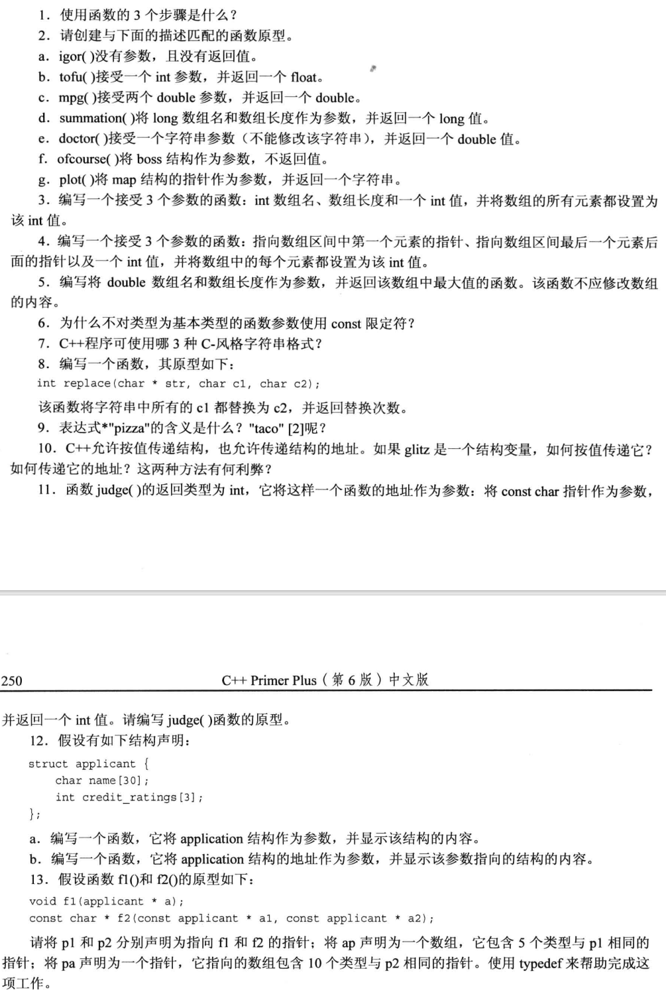

# 函数——C++的编程模块

## 复习函数的基本知识

- 提供函数定义
- 提供函数原型
- 调用函数

### 定义函数

```cpp
typeName functionName(parameterList)
{
    statement;
    return value;
}
```

## 函数参数和按值传参

定义单参数函数

```cpp
double cube(double x)
```

使用函数时，将传递一个名称为 x 的副本变量，值为 5

### 多个参数

调用时使用逗号分隔参数

```cpp
n_chars('R', 25);
```

定义函数时，使用逗号分隔参数声明列表：

```cpp
void n_chars(float a, float b)
```

```cpp
#include<iostream>
using namespace std;
void n_chars(char c, int n);

int main(void)
{
    int times;
    char ch;

    cout << "Enter a character: ";
    cin >> ch;
    while(ch != 'q')
    {
        cout << "Enter an integer: ";
        cin >> times;
        n_chars(ch, times);
        cout << endl;
        cout << "Enter another character or press q_key to quit: ";
        cin >> ch;
    }

    return 0;
}

void n_chars(char c, int n)
{
    while(n-- > 0)
        cout << c;
}
```

输出结果：

```cpp
Enter a character: a
Enter an integer: 20
aaaaaaaaaaaaaaaaaaaa
Enter another character or press q_key to quit: b
Enter an integer: 20
bbbbbbbbbbbbbbbbbbbb
Enter another character or press q_key to quit: q
```

## 函数和数组

```cpp
int sum_arr(int arr[], int n);
```

传递的是数组的地址，下标引用运算符`arr[1]`的作用相当于`*(arr + 1)`

### 函数如何使用指针来处理数组

数组名：

- 将数组名视为指针
- 数组声明使用数组名来标记内存位置
- 对数组名使用`sizeof`将返回整个数组的长度（以字节为单位）
- 将地址运算符用于数组名时，将返回整个数组的地址

### 将数组作为参数意味着什么

传递数组地址可以节省计算机开销，通过地址直接找到原始数据，对其操作

使用原始数据增加了破坏数据的风险，`const`限定符解决了这一问题

### 更多数组函数示例

```cpp
#include<iostream>
using namespace std;

const int MAX = 5;

int fill_array(double arr[], int limit);
void show_array(const double arr[], int n);
void revalue(double r, double arr[], int n);

int main(void)
{
    double properties[MAX];

    //读入房地产价值数组
    int size = fill_array(properties, MAX);

    //显示数组
    show_array(properties, MAX);

    //重新评估房地产价值
    if(size > 0)
    {
        cout << "Enter revalution factor: ";  //比例系数，调整价格
        double factor;
        while(!(cin >> factor))   //只要输入不是数字，就重新输入
        {
            cin.clear();
            while(cin.get() != '\n')
            {
                continue;
            }
            cout << "Bad input: input process terminated." << endl;
        }
        revalue(factor, properties, size);
        show_array(properties, size);
    }

    return 0;
}

int fill_array(double arr[], int limit)
{
    double temp = 0;
    int i = 0;

    for (i = 0; i < MAX; i++)
    {
        cout << "Enter value #" << i + 1 << ": ";
        cin >> temp;   //不能小于0；不能为字符
        if(!cin)       //cin失败，读入字符，结束输入
        {
            cin.clear();
            while(cin.get() != '\n')
            {
                continue;
            }
            cout << "Bad input: input process terminated." << endl;
            break;
        }
        else if(temp < 0)  //cin失败。读入负数
            break;
        else
            arr[i] = temp;
    }
    return i;
}

void show_array(const double arr[], int n)   //不能通过指针修改原地址变量
{
    for (int i = 0; i < n; i++)
    {
        cout << "Property #" << i + 1 << ": $";
        cout << arr[i] << endl;
    }
}

void revalue(double r, double arr[], int n)
{
    for (int i = 0; i < n; i++)
    {
        arr[i] *= r;
    }
}
```

输出结果：

```cpp
Enter value #1: 10000
Enter value #2: 20000
Enter value #3: 30000
Enter value #4: 88889
Enter value #5: 27777
Property #1: $10000
Property #2: $20000
Property #3: $30000
Property #4: $88889
Property #5: $27777
Enter revalution factor: 1.2
Property #1: $12000
Property #2: $24000
Property #3: $36000
Property #4: $106667
Property #5: $33332.4
```

### `const`与指针的用法

1. `const int *pt;` `const`修饰的指针，不能通过指针修改指向的内容

```cpp
// const int *pt;

#include<iostream>
using namespace std;

int main(void)
{
    int n = 10;
    int m = 100;
    const int *pt = &n; // 指针设置为常量，不能通过指针修改指向的内容

    cout << "1) n = " << n << endl;
    //*pt = 20;
    pt = &m;
    n = 20;
    cout << "2) n = " << n << endl;
    cout << "*pt = " << *pt << endl;
    cout << "m = " << m << endl;

    return 0;
}
```

输出结果：

```cpp
1) n = 10
2) n = 20
*pt = 100
m = 100
```

2. `int *const pt;` pt 指针只能指向一个变量，且可以修改指向地址的内容

```cpp
// int *const pt;

#include <iostream>
using namespace std;

int main(void)
{
    int n = 10;
    //int m = 100;
    int *const pt = &n;  //pt指针只能指向一个变量，且可以修改指向地址中的内容

    cout << "1) n = " << n << endl;
    *pt = 20;
    cout << "2) n = " << n << endl;

    // pt = &m;
    // cout << "*pt = " << *pt << endl;
    // cout << "m = " << m << endl;

    return 0;
}
```

输出结果：

```cpp
1) n = 10
2) n = 20
```

3. `const int *const pt;` pt 指针只能指向一个内容，且不能修改指向地址中的内容

## 函数和二维数组

二位数组传参，数组名表示数组首元素地址

```cpp
int sum(int (*pt)[4], int size);  //1
int sum(int pt2[][4], int size);  //2

//引用
int total = sum(a, 10);
```

二维数组的元素引用可以写成：
`ar2[r][c] == *(*(ar2 + r) + c)`

## 函数和 C 风格的字符串

### 将 C 风格字符串作为参数的函数

表示字符串的方法：

1. `char`数组
2. 用双引号引用起来的字符串常量
3. 被设置为字符串的地址的`char`指针

```cpp
#include<iostream>
using namespace std;
unsigned int c_in_str(const char *str, char ch);

int main(void)
{
    char mmm[15] = "minimum";
    const char *wail = "ululate";  //字符串常量，定义const指针使指针不能更改地址的内容

    unsigned int ms = c_in_str(mmm, 'm');
    unsigned int us = c_in_str(wail, 'u');

    cout << ms << " m characters in " << mmm << endl;
    cout << us << " u characters in " << wail << endl;

    return 0;
}

unsigned int c_in_str(const char *str, char ch)
{
    unsigned int count = 0;

    while (*str)
    {
        if(*str == ch)
            count++;

        str++;
    }

    return count;
}
```

输出结果：

```cpp
3 m characters in minimum
2 u characters in ululate
```

### 返回 C—风格字符串的函数

函数无法返回一个字符串，**但可以返回字符串的地址**，这样效率更高

```cpp
#include<iostream>
using namespace std;
char *buildstr(char ch, int n);

int main(void)
{
    char ch;
    int times;

    cout << "Enter a character: ";
    cin >> ch;
    cout << "Enter an integer: ";
    cin >> times;

    char *ps = buildstr(ch, times);
    cout << ps << endl;
    delete[] ps;  //new后释放内存

    return 0;
}
char *buildstr(char ch, int n)
{
    char *ps = new char[n + 1];
    ps[n] = '\0';  //字符串结尾使'\0'
    for (int i = 0; i < n; i++)
    {
        ps[i] = ch;
    }

    return ps;
}
```

输出结果：

```cpp
Enter a character: v
Enter an integer: 10
vvvvvvvvvv
```

## 函数和结构

传递的是结构体的副本

函数也可以返回结构

结构名只是结构体的名称，要获得结构体的地址，需要使用`&`

```cpp
#include<iostream>
using namespace std;

const int Min_per_hr = 60;

struct travel_time
{
    int hours;
    int mins;
};

travel_time sum(travel_time t1, travel_time t2);
void show_time(travel_time t);

int main(void)
{
    travel_time day1 = {5, 45};
    travel_time day2 = {4, 55};

    travel_time trip = sum(day1, day2);
    cout << "Two days total: ";
    show_time(trip);

    travel_time day3 = {4, 32};
    cout << "Three days total: ";
    show_time(sum(trip, day3));

    return 0;
}

travel_time sum(travel_time t1, travel_time t2)
{
    travel_time total;

    total.mins = (t1.mins + t2.mins) % Min_per_hr;
    total.hours = t1.hours + t2.hours + (t1.mins + t2.mins) / Min_per_hr;

    return total;
}
void show_time(travel_time t)
{
    cout << t.hours << " Hours, " << t.mins << " Minutes.\n";
}
```

输出结果：

```cpp
Two days total: 10 Hours, 40 Minutes.
Three days total: 15 Hours, 12 Minutes.
```

## 函数和`string`对象

`string`对象和结构体的使用相似

1. 可以将一个对象赋给另一个对象；
2. 可以将对象作为完整的实体进行传递。

如果需要多个字符串，可以声明一个`string`对象数组，而不是一个二维数组

声明一个 string 对象数组，并将其传递给函数以显示其内容：

```cpp
#include<iostream>
#include<string>
using namespace std;

const int SIZE = 5;

void display(const string *sa, int n);

int main(void)
{
    string list[SIZE];

    cout << "Enter: " << SIZE << " favorite food: " << endl;

    for (int i = 0; i < SIZE; i++)
    {
        cout << i + 1 << ": ";
        getline(cin, list[i]);
    }

    cout << "Your list: " << endl;
    display(list, SIZE);

    return 0;
}

void display(const string *sa, int n)
{
    for (int i = 0; i < n; i++)
    {
        cout << i + 1 << ": " << sa[i] << endl;
    }
}
```

输出结果：

```cpp
Enter: 5 favorite food:
1: milk
2: cake
3: icecream
4: salad
5: break
Your list:
1: milk
2: cake
3: icecream
4: salad
5: break
```

## 函数和`array`对象

1. 按值传递 传递副本
2. 传递指向对象的指针，这使得函数可以操作原始对象

## 递归

### 包含一个递归调用的递归

```cpp
void recurs(argumentlist)
{
    statements1
    if (test)
        recurs(arguments)
    statements2
}
```

例如：

```cpp
#include<iostream>
using namespace std;
void countdown(int n);

int main(void)
{
    countdown(4);

    return 0;
}

void countdown(int n)
{
    //statement1
    cout << "counting down... " << n << endl;

    //test
    if (n > 0)
    {
        countdown(n-1);
    }

    //statement2
    cout << n << ": Kadoom" << endl;
}
```

输出结果：

```cpp
counting down... 4
counting down... 3
counting down... 2
counting down... 1
counting down... 0
0: Kadoom
1: Kadoom
2: Kadoom
3: Kadoom
4: Kadoom
```

### 包含多个递归调用的递归

```cpp
#include<iostream>
using namespace std;

const int Len = 66;
const int Divs = 6;

void subdivide(char ar[], int low, int high, int levels);

int main(void)
{
    char ruler[Len];

    for (int i = 0; i < Len; i++)
        ruler[i] = ' ';

    int min = 0;
    int max = Len - 2;
    ruler[Len - 1] = '\0';
    ruler[min] = ruler[max] = '|';
    cout << ruler << endl;  //打印第一行

    for (int i = 1; i <= Divs; i++)
    {
        subdivide(ruler, min, max, i);
        cout << ruler << endl;
    }

    return 0;
}

void subdivide(char ar[], int low, int high, int levels)
{
    if(levels == 0)
        return;

    int mid = (low + high) / 2;
    ar[mid] = '|';

    subdivide(ar, low, mid, levels - 1);
    subdivide(ar, mid, high, levels - 1);
}
```

输出结果：

```cpp
|                                                               |
|                               |                               |
|               |               |               |               |
|       |       |       |       |       |       |       |       |
|   |   |   |   |   |   |   |   |   |   |   |   |   |   |   |   |
| | | | | | | | | | | | | | | | | | | | | | | | | | | | | | | | |
|||||||||||||||||||||||||||||||||||||||||||||||||||||||||||||||||
```

## 函数指针

函数的地址：存储机器语言代码的内存的开始地址。

可以编写另一个函数的地址作为参数的函数。**意味着可以在不同的时间使用不同的函数**

### 函数指针的基础知识

设计一个名为`estimate()`的函数，估算编写指定行数的代码所需要的时间。函数将有一部分是相同的，但该函数允许每个程序员提供自己的算法来估算时间。为实现这种目标，采用的机制是，将程序员要使用的算法函数的地址传递给`estimate()`。为此，它必须可以完成以下功能：

1. 获取函数的地址：
   
   **使用函数名，不用带参数**，函数名就是函数的地址 `process(think);`

2. 声明一个函数指针:
   
   函数原型：`double pam(int);`

   正确的指针类型：`double (*pf)(int);` 
   
   用`(*pf)`替换函数名 **这是一种类型函数的指针 不是某特定类型函数的指针**

   对于`estimste()`：代码行数、估算算法，函数原型是：

   ```cpp
   void estimate(int lines, double (*pf)(int));
   ```
   

3. 使用函数指针来调用函数
   
   将(*pf)看作函数名

```cpp
#include<iostream>
using namespace std;
double GJT(int lines);
double CBC(int lines);
void estimate(int lines, double (*pf)(int));

int main(void)
{
    int code = 0;

    cout << "How many lines code do you need?: ";
    cin >> code;
    cout << "Here is GJT's estimate: " << endl;
    estimate(code, GJT);
    cout << "Here is CBC's estimate: " << endl;
    estimate(code, CBC);

    return 0;
}
double GJT(int lines)
{
    return lines * 0.05;
}
double CBC(int lines)
{
    return lines * 0.03 + 0.004 * lines * lines;
}
void estimate(int lines, double (*pf)(int))
{
    cout << lines << " lines code will take " << (*pf)(lines) << " seconds." << endl;
}
```
输出结果：
```cpp
How many lines code do you need?: 29
Here is GJT's estimate:
29 lines code will take 1.45 seconds. 
Here is CBC's estimate:
29 lines code will take 4.234 seconds.
```

### 深入探讨函数指针

```cpp
#include<iostream>
using namespace std;

const double *f1(const double *pa, int n);
const double *f2(const double *pa, int n);
const double *f3(const double *pa, int n);

int main(void)
{
    double ap[3] = {1112.3, 1542.6, 2227.9};

    //part1
    //p1(p2): pointer to a function
    const double *(*p1)(const double *, int) = f1;                     //(*p1)代替函数名
    auto p2 = f2;
    cout << "********PART1********" << endl;
    cout << "Address         Value" << endl;
    cout << (*p1)(ap, 3) << ":       " << *(*p1)(ap, 3) << endl;       //(*p1)(ap, 3) == p1(ap, 3) == f1(ap, 3)
    cout << p2(ap, 3) << ":       " << *p2(ap, 3) << endl;

    //part2
    //pa(pb) is an array of pointers
    const double *(*pa[3])(const double *, int) = {f1, f2, f3};
    auto pb = pa;
    cout << endl;
    cout << "********PART2********" << endl;
    cout << "Address         Value" << endl;
    for (int i = 0; i < 3; i++)
    {
        cout << pa[i](ap, 3) << ":       " << *pa[i](ap, 3) << endl;
    }
    for (int i = 0; i < 3;i++)
    {
        cout << pb[i](ap, 3) << ":       " << *pb[i](ap, 3) << endl;
    }

    //part3
    //pc(pd) is a pointer to the array(pa) of three elements(funstion pointers)
    auto pc = &pa;
    const double *(*(*pd)[3])(const double *, int) = &pa;
    cout << endl;
    cout << "********PART3********" << endl;
    cout << "Address         Value" << endl;
    cout << (*pc)[0](ap, 3) << ":       " << *(*pc)[0](ap, 3) << endl; //(*pc) == pa
    const double *pdb = (*pd)[1](ap, 3);
    cout << pdb << ":       " << *pdb << endl;
    //cout << (*pd)[2](ap, 3) << ":       " << *(*pd)[2](ap, 3) << endl;
    cout << (*(*pd)[2])(ap, 3) << ":       " << *(*(*pd)[2])(ap, 3) << endl;

    return 0;
}

//返回数组第一个元素的地址
const double *f1(const double *pa, int n)
{
    return pa;
}

//返回数组第二个元素的地址
const double *f2(const double *pa, int n)
{
    return pa + 1;
}

//返回数组第三个元素的地址
const double *f3(const double *pa, int n)
{
    return pa + 2;
}
```
输出结果：
```cpp
********PART1******** 
Address         Value 
0x61fdc0:       1112.3
0x61fdc8:       1542.6

********PART2******** 
Address         Value 
0x61fdc0:       1112.3
0x61fdc8:       1542.6
0x61fdd0:       2227.9
0x61fdc0:       1112.3
0x61fdc8:       1542.6
0x61fdd0:       2227.9

********PART3********
Address         Value
0x61fdc0:       1112.3
0x61fdc8:       1542.6
0x61fdd0:       2227.9
```

## 复习题



1. 函数的定义；函数的调用；函数的原型
2. 函数原型
   ```cpp
   void igor(void);
   float tofu(int);
   double mpg(double, double);
   long summation(long arr[], int n);
   double doctor(const char*str);
   void ofcourse(boss bs);
   char * plot(map *pm);
   ```
3. ```cpp
   void set_array(int arr[], int size, int n)
   {
       for(int i = 0; i < size; i++)
           arr[i] = n;
   }
   ```