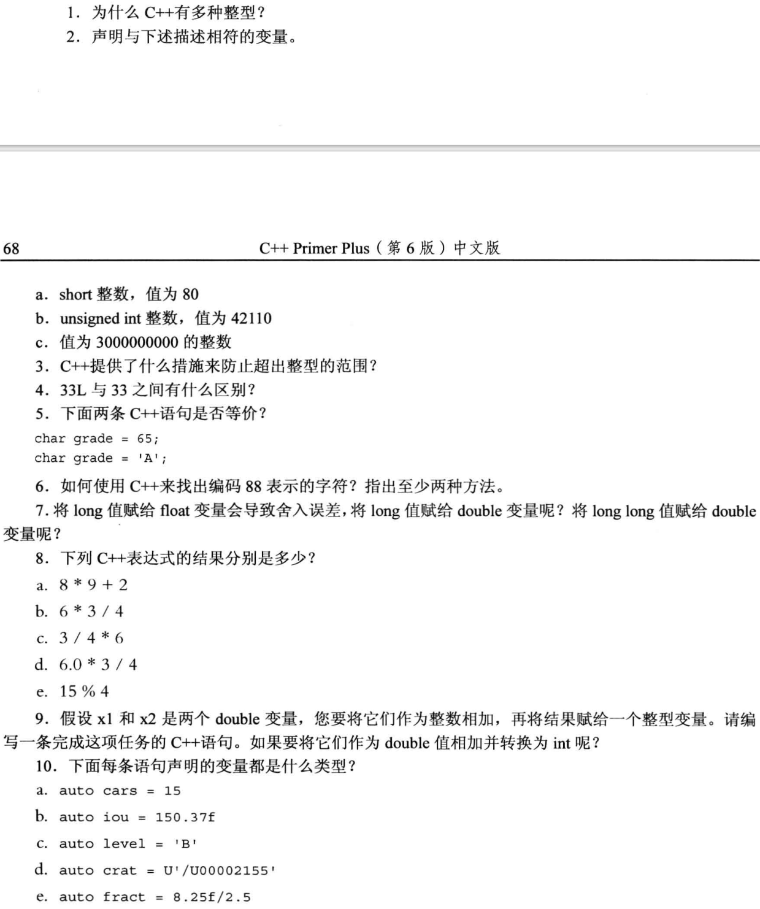

# 处理数据

## 简单变量

### 变量名
1. 名称中使用**字母、数字、下划线**
2. 名称**第一个字符**不能是数字
3. 区分大小写
4. 不能使用**关键字**为名称
5. C++对名称的**长度没有限制**，有的平台会有限制
6. 以两个下划线或下划线和大写字母大头的名称被保留给实现使用。

## 整型
任何语言只能表示所有整数的一个子集。

基本整形：char; short; int; long; long long。以及unsigned

1. short至少16位
2. int至少与short一样长
3. long至少32位，且至少与int一样长
4. long long至少64位，且至少和long一样长

```cpp
#include<iostream>
#include<climits>
using namespace std;

int main(void)
{
    int n_int = INT_MAX;

    cout << "int is " << sizeof(int) << " bytes."<<endl;
    cout << "int: " << n_int;

    return 0;
}
```

### 无符号类型
例如：short的范围是-32768~+32767；无符号版本是0~65535；

### 整型字面值
1. 第一位1~9，十进制
2. 第一位0，八进制
3. 前两位0X/0x，十六进制

默认情况下，cout以十进制格式显示整数

```cpp
#include<iostream>
using namespace std;

int main(void)
{
    int chest = 42;
    int waist = 0x42;
    int inseam = 042;

    cout << "Monsieur cuts a striking figure!" << endl;
    cout << "chest = " << chest << " (42 in decimal)" << endl;
    cout << "waist = " << waist << " (0x42 in hex)" << endl;
    cout << "inseam = " << inseam << " (042 in octal)" << endl;

    return 0;
}
```

输出结果：
```cpp
Monsieur cuts a striking figure!
chest = 42 (42 in decimal)      
waist = 66 (0x42 in hex)        
inseam = 34 (042 in octal)  
```

若cout要以十六进制、八进制输出则：
要使用`cout << hex`;`cout << oct`

```cpp
#include <iostream>
using namespace std;

int main(void)
{
    int chest = 42;
    int waist = 0x42;
    int inseam = 042;

    cout << "Monsieur cuts a striking figure!" << endl;
    cout << "chest = " << chest << " (in decimal)" << endl;

    cout << hex;
    cout << "waist = " << waist << " (in hex)" << endl;

    cout << oct;
    cout << "inseam = " << inseam << " (in octal)" << endl;

    return 0;
}
```

输出结果：
```cpp
Monsieur cuts a striking figure!
chest = 42 (in decimal)
waist = 42 (in hex)
inseam = 42 (in octal)
```

### C++如何确定常量的类型

整型常量，如1983，除非有理由存储为其他类型，默认存储为`int`类型

### char类型：字符和小整数

`char`类型是专位存储字符（字母和数字）而设计的。存储的是字符对应的编码。

产检的符号集是ASCII字符集。字符集中的字符用数值编码（ASCII码）表示。

ASCII码 : `A : 65；a : 97`

`cin`;`cout`可以读取字符，并转化为相应的ASCII，再存储或输出。

输入字符M：

```cpp
#include<iostream>
using namespace std;

int main(void)
{
    char ch;

    cout << "Enter a character: ";
    cin >> ch;
    cout << "Hello! Thank you for the " << ch << " character." << endl;

    return 0;
}
```

#### 通过`cout.put()`成员函数输出字符

```cpp
#include <iostream>
using namespace std;

int main(void)
{
    char ch = 'M'; // 存储的是M对应的ASCII值
    int i = ch;    // 赋值的时候把ch里面存储的ASCII取了出来
    cout << "The ASCII code fot " << ch << " is " << i << endl;

    cout << "Add one to the character code: " << endl;
    ch = ch + 1;
    i = ch;
    cout << "The ASCII code for " << ch << " is " << i << endl;

    cout << "Displaying char ch using cout.put(ch): ";
    cout.put(ch);
    cout.put('!');

    cout << endl
         << "Done" << endl;

    return 0;
}
```

输出结果是：
```cpp
The ASCII code fot M is 77
Add one to the character code:
The ASCII code for N is 78
Displaying char ch using cout.put(ch): N!
Done
```

#### 转义字符

|字符名称|C++代码|
|:---:|:---:|
|换行符|\n|
|水平制表符|\t|
|垂直制表符|\v|
|退格|\b|
|回车|\r|
|振铃|\a|
|反斜杠|\\\\
|问号|\\?|
|单引号|\\'|
|双引号|\\"|


## `const`限定符

使用`const`关键字来修改变量的**声明和初始化**

```cpp
const int Months = 12; //常量被初始化后，其值就被固定，不允许修改
```

将变量的首字母大写，如Months，以区分变量和常量。

创建的通用格式是：
```cpp
const type name = value;
```

以下代码写法不好：
```cpp
const int toes;  //报错常量未被初始化
toes = 10;  //报错常量不允许被修改
```


## 浮点数

带小数的数字

计算机分为**两部分存储**：一部分表示值，另一部分表示缩放因子

### 书写浮点数

1. 标准小数点表示法：`12.34`
2. E表示法：`2.52e+8`

### 浮点类型

C++有3种浮点类型：`float` `double` `long double`

1. `float`至少32位
2. `double`至少48位，且不少于`float`
3. `long double`至少和`double`一样多

显示`float`和`double`的精度区别:

```cpp
#include<iostream>
using namespace std;

int main(void)
{
    cout.setf(ios_base::fixed, ios_base::floatfield);

    float tub = 10.0 / 3.0;
    const float million = 1.0e6;

    cout << "tub = " << tub;
    cout << " , A million tubs = " << tub * million << endl;
    cout << "Ten million tubs = " << 10 * tub * million << endl;

    double mint = 10.0 / 3.0;

    cout << "mint = " << mint;
    cout << " , A million mints = " << mint * million << endl;
    cout << "Ten million mints = " << 10 * mint * million << endl;

    return 0;
}
```

输出结果：
```cpp
tub = 3.333333 , A million tubs = 3333333.250000
Ten million tubs = 33333332.000000
mint = 3.333333 , A million mints = 3333333.333333
Ten million mints = 33333333.333333
```

`double`比`float`类型的精度要高很多

### 浮点数的优缺点

优点：表示的范围比整数大得多

缺点：运算慢、精度降低

以下代码说明了浮点运算会降低精度这一缺点：

```cpp
#include<iostream>
using namespace std;

int main(void)
{
    float a = 2.34e22f;
    float b = a + 1.0f;

    cout << "a = " << a << endl;
    cout << "b - a = " << b - a << endl;

    return 0;
}
```
输出结果：
```cpp
a = 2.34e+22
b - a = 0  
```

`a`和`b`相差为`1.0`，计算结果却是无误差。

问题在于，2.34E+22是一个小数点左边有23位的数字。加上1，就是在第23位加1。但float类型**只能表示数字中的前6位或前7位**，因此修改第23位对这个值不会有任何影响。


## C++算数运算符

`+ - * / %` 

### 类型转换

#### 初始化和赋值进行转换

+ `so_long = thirty` 小范围类型得数可以赋值给大范围的变量，原变量不变，所存数据被扩展
+ 大范围得值传递给小范围的值，会出现问题

#### 以`{}`方式初始化时进行的转换

+ 列表初始化不允许缩窄
+ 不允许使用变量，有超出范围得风险

#### 表达式中的转换

+ 一些类型在出现时便会自动转换
+ 有些类型在与其他类型同时出现在表达式中时将被转换
  + 计算时将做**数据类型的提升**
  
#### 强制类型转换

#### C++11中的auto声明

关键字，编译器根据初始值的类型推断变量的类型

## 复习题



1. 


