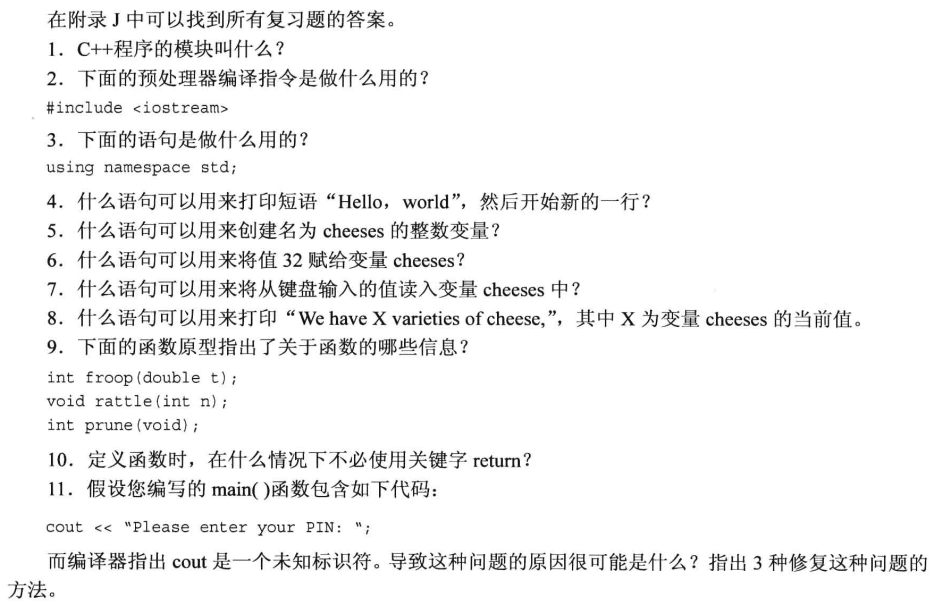

<!-- TOC -->

- [开始学习c++](#开始学习c)
  - [进入c++](#进入c)
    - [头文件名](#头文件名)
    - [名称空间](#名称空间)
    - [使用`cout`进行C++输出](#使用cout进行c输出)
      - [控制符`endl`](#控制符endl)
      - [换行符`\n`](#换行符n)
    - [C++源代码的格式化](#c源代码的格式化)
      - [源代码风格](#源代码风格)
  - [C++语句](#c语句)
    - [声明语句和变量](#声明语句和变量)
    - [赋值语句](#赋值语句)
    - [cout新花样](#cout新花样)
  - [其他C++语句](#其他c语句)
    - [使用`cin`](#使用cin)
    - [类简介](#类简介)
  - [函数](#函数)
    - [使用有返回值的函数](#使用有返回值的函数)
    - [函数变体](#函数变体)
    - [用户定义的无返回值的函数](#用户定义的无返回值的函数)
    - [用户定义的有返回值的函数](#用户定义的有返回值的函数)
  - [复习题](#复习题)
  - [编程练习](#编程练习)

<!-- /TOC -->

# 开始学习c++

## 进入c++
1. c++程序必须包含main函数
2. 注释：// 注释本行 ；/*  */ 注释一段文字
3. 使用cin cout 必须包含文件iostream
4. 必须包含`#include<iostream>`,`using namespace std`

### 头文件名
c++去掉了.h后缀，加上前缀c；例如：`math.h`->`cmath`

### 名称空间
目的是解决同名函数的冲突问题。

名称空间编译指令：`using namespace std` ，那么后面不必使用`std::`前缀，对于简单程序而言，一次设置，简化写法。
```cpp
#include<iostream>
int main()
{
    using namespace std;
    return 0;
}
```

### 使用`cout`进行C++输出
显示消息:`<<`（插入运算符）表示把字符串发送给`cout`
```cpp；将字符串插入到输出流当中。
cout << "Come up and C++ me some time.";  
```

#### 控制符`endl`
`cout endl` 的作用：重起一行

#### 换行符`\n`
`cout << "\n"`
`cout << endl`

### C++源代码的格式化
以一定的格式编写，提高程序可阅读性。

#### 源代码风格
1. 源代码当中的**标记和空白**
2. 每条语句**占用一行**
3. 函数用**花括号**括起来，并独立占用一行
4. 函数体相对于花括号进行**缩进**
5. 增加注释
6. 增加空行
7. 函数名称的圆括号附近没有空白`int main()`

## C++语句

### 声明语句和变量
声明变量，可以避免拼写产生的编译错误；C++,通常是在**首次**使用变量前进行声明。

### 赋值语句
```cpp
carrots = 20;
```

### cout新花样
`cout <<` 根据其后的数据类型相应的调整行为，智能地调整输出内容
```cpp
#include<iostream>

int main()
{
    using namespace std;

    int carrots;   //声明语句创建变量

    carrots = 20;  //赋值语句给变量提供一个值
    cout << "I have ";
    cout << carrots;
    cout << " carrots.";
    cout << endl;
    
    carrots -= 1;
    cout << "Cruch, Cruch, Now I have " << carrots << " carrots." << endl;

    return 0;
}
```
## 其他C++语句

### 使用`cin`
从键盘输入赋值`cin >> carrots;`
```cpp
#include<iostream>

int main()
{
    using namespace std;

    int carrots;

    cout << "How many carrots do you have?" << endl;
    cin >> carrots;  //程序输入流流入carrots中
    cout << "Here are two more." << endl;  //不加 endl 两句话将连在一起，不会因为中间有其他语句而分开
    carrots += 2;
    cout << "Now you have " << carrots << " carrots." << endl;

    return 0;
}
```

### 类简介
类是用户定义的一种数据类型。

类包含：能够表述什么养的信息 、可对数据进行哪些操作。（数据以及操作数据的方法）  

`类(iostream)->对象(cout、cin)`  类比于  `类型(int)->变量(carrots)` 

类定义描述的是**数据格式**及其**用法** 对象是类的**具体实例化**

类库等同于函数库，像调用函数一样调用类。


## 函数

### 使用有返回值的函数

C++函数分为两种：**有返回值**和**无返回值**

发送给函数的信息叫做**参数**；发送回去的值叫做**返回值**。使用函数之前，C++编译器必须知道函数的**参数类型**和**返回值类型**。
```cpp
double sqrt(double);
//返回类型：double;参数类型：double
```
函数原型结尾的`;`表明它是一条语句，是一个原型，而不是一个函数头。

提供原型的方法：
1. 源代码文件中**输入函数原型**
2. 包含头文件`cmath`，其中定义了原型
   
应在首次使用前提供原型。通常是把原型放到`main()`函数定义的前面。
```cpp
#include<iostream>
#include<cmath>   //包含头文件,定义了函数原型

int main()
{
    using namespace std;

    double area;
    cout << "Enter the floor area, in square feet, of your home: ";
    cin >> area;

    double side;
    side = sqrt(area);

    cout << "That's the equivalent of a square " << side << " feet to the side." << endl;

    return 0;
}
```

### 函数变体

1. 返回值为多个参数
```cpp
double pow(double,double);
```

2. 函数不接受任何参数
```cpp
int rand(void);
```

3. 函数没有返回值
```cpp
void bucks(double);
```

### 用户定义的无返回值的函数

定义函数`void simon(int n)` 无返回值，需要提供参数。

```cpp
#include<iostream>
void simon(int n);      //函数原型声明

int main()
{
    using namespace std;

    simon(3);          //函数调用
    cout << "Pick an integer: ";
    int count;
    cin >> count;
    simon(count);
    cout << "Done!" << endl;

    return 0;
}

void simon(int n)      //函数定义
{
    using namespace std;

    cout << "Simon sys touch your toes " << n << " times. " << endl;
}
```

### 用户定义的有返回值的函数

定义 英石`<->`磅 转化函数`int stonetolb(int sts)`

```cpp
#include<iostream>
int stonetolb(int sts);

int main()
{
    using namespace std;

    int stone;
    cout << "Enter the weight in stone: ";
    cin >> stone;

    int pounds = stonetolb(stone);
    cout << stone << " stone = "
         << pounds << " pounds." << endl;

    return 0;
}

//1 stone = 14 lbs
int stonetolb(int sts)
{
    return 14 * sts;
}
```

## 复习题

1. 函数
2. 包含`iostream`头文件，将头文件内容添加到源代码当中
3. `using`是预编译指令，使用`std`命名空间
4. `cout << "Hello world!" << endl`
5. `int cheeses;`
6. `cheeses = 32;`
7. `cin >> cheeses;`
8. `cout >> "We have " >> cheeses >> "varieties of cheses." << endl;`
9. 函数名的信息
   1.  函数名是`froop`,一个参数`t`，参数类型是`double`,返回类型是`int`
   2.  函数名是`rattle`，一个参数`n`，参数类型是`int`，无返回值
   3.  函数名是`prune`,无参数，返回类型是`int`
10. 当函数是无返回值的时候，例如：`void rattle(int n)`
11. 未指出命名空间`std`，解决方法是：
    1.  全局/局部引用：`using namespace std;`
    2.  全局/局部引用：`using std::cout;`
    3.  使用语句前：`std::cout;`

## 编程练习

1. 编写一个C++程序，它显示您的姓名和地址。

运行代码：
```cpp
#include<iostream>
using namespace std;

int main(void)
{
    cout << "GJT" << endl;
    cout << "I live in China." << endl;

    return 0;
}
```

2. 编写一个C++程序，它要求用户输入一个以long为单位的距离，然后将它转换为码
(一long等于220码)。

运行代码：
```cpp
#include<iostream>
using namespace std;

int main(void)
{
    double distance;

    cout << "Please input the distance: ";
    cin >> distance;

    double ma = distance * 220;
    cout << distance << " long = " << ma << " yard.";

    return 0;
}
```

3. 编写一个C++程序，它使用3个用户定义的函数（包括main())，并生成下面的输出:

```cpp
Three blind mice
Three blind mice
see how they run
see how they run
```
运行代码：
```cpp
#include<iostream>
using namespace std;
void print_mice(void);
void print_run(void);

int main(void)
{
    print_mice();
    print_mice();
    print_run();
    print_run();

    return 0;
}
void print_mice(void)
{
    cout << "Three blind mice." << endl;
}
void print_run(void)
{
    cout << "See how they run." << endl;
}
```

4. 编写一个程序，让用户输入其年龄，然后显示该年龄包含多少个月，如下所示:
   
```cpp
Enter your age: 29
Your age in month is 348
```
运行代码：
```cpp
#include <iostream>
using namespace std;

int main(void)
{
    int age;

    cout << "Please enter your age: ";
    cin >> age;
    cout << "Your age in month is " << age * 12 << "." << endl;

    return 0;
}
```

5. 编写一个程序，其中的 main()调用一个用户定义的函数（以摄氏温度值为参数，并返回相应的华氏温度值)。该程序按下面的格式要求用户输入摄氏温度值，并显示结果:

```cpp
Please enter a Celsius value: 20
20 degrees Celsius is 68 degrees Fahrenheit.
```

下面是转换公式：
$$
华氏温度=1.8\times摄氏温度+32  
$$

运行代码：
```cpp
#include<iostream>
using namespace std;
double CeltoFah(double cel);

int main(void)
{
    double Cel;
    
    cout << "Please enter a Celsius value: ";
    cin >> Cel;

    double Fah = CeltoFah(Cel);
    cout << Cel << " degrees Celsius is " << Fah << " degrees Fahrenheit." << endl;

    return 0;
}

double CeltoFah(double cel)
{
    return cel * 1.8 + 32.0;
}
```

6. 编写一个程序，其main()调用一个用户定义的函数（以光年值为参数，并返回对应天文单位的值)。该程序按下面的格式要求用户输入光年值，并显示结果:

```cpp
Enter the number of light years:4.2
4.2 light years = 265608 astronomical units.
```

天文单位是从地球到太阳的平均距离（约150000000公里或93000000
英里)，光年是光一年走的距离
(约10万亿公里或6万亿英里)(除太阳外，最近的恒星大约离地球4.2光年)。请使用double类型(参见程序清单2.4)，转换公式为:

$$
1 光年 = 63240 天文单位
$$

运行代码：
```cpp
#include<iostream>
using namespace std;
double lttoas(double ly);

int main(void)
{
    double ltyear;

    cout << "Enter thr number of light years: ";
    cin >> ltyear;

    double asun = lttoas(ltyear);
    cout << ltyear << " light years = " << asun << " astronomical units.";

    return 0;
}

double lttoas(double ly)
{
    return ly * 63240;
}
```

7. 编写一个程序，要求用户输入小时数和分钟数。在main()函数中，将这两个值传递给一个void函数，后者以下面这样的格式显示这两个值:

```cpp
Enter the number of hours: 9
Enter the number of minutes:28
Time: 9:28
```

运行代码：
```cpp
#include<iostream>
using namespace std;
void Time(int a, int b);

int main(void)
{
    int hour,min;

    cout << "Enter the number of hours: ";
    cin >> hour;
    cout << "Enter the number of minutes: ";
    cin >> min;

    Time(hour, min);

    return 0;
}

void Time(int a, int b)
{
    cout << "Time: " << a << ":" << b;
}
```


