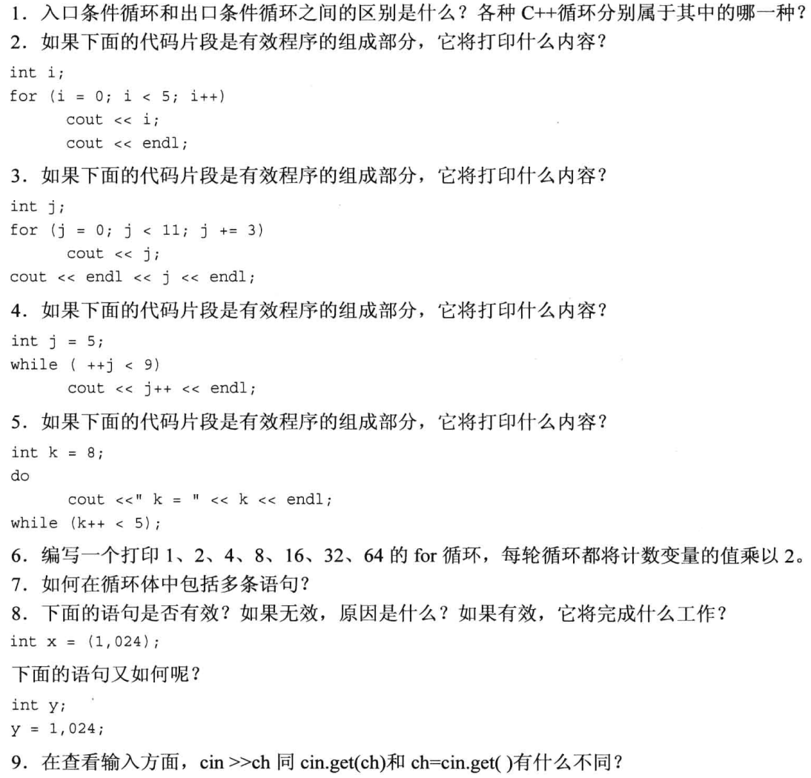

<!-- TOC -->

- [循环和关系表达式](#循环和关系表达式)
  - [`for`循环](#for循环)
    - [`for`循环的组成部分](#for循环的组成部分)
    - [回到`for`循环](#回到for循环)
    - [递增递减运算符](#递增递减运算符)
    - [递增/递减运算符和指针](#递增递减运算符和指针)
  - [`while`循环](#while循环)
    - [`while`编写延时循环](#while编写延时循环)
    - [创建别名](#创建别名)
  - [`do while`循环](#do-while循环)
  - [循环和文本输入](#循环和文本输入)
    - [文件尾条件](#文件尾条件)
  - [嵌套循环和二维数组](#嵌套循环和二维数组)
  - [复习题](#复习题)

<!-- /TOC -->

# 循环和关系表达式

## `for`循环

**定次数循环**

一个`for`循环示例

```cpp
#include<iostream>
using namespace std;

int main(void)
{
    int i;

    for (i = 0; i < 5;i++)
    {
        cout << "C++ knows loop." << endl;
    }
    cout << "C++ knows when to stop." << endl;

    return 0;
}
```

输出结果：

```cpp
C++ knows loop.
C++ knows loop.
C++ knows loop.
C++ knows loop.
C++ knows loop.
C++ knows when to stop.
```

### `for`循环的组成部分

循环格式

```cpp
for(initialization;test-expression;update-expression)
{
    body;
}
```

可以在`for`循环的初始化部分中声明变量

```cpp
for(int i = 0; i<5; i++)  //i只存在于`for`循环之中
{
    body;
}
```

### 回到`for`循环

阶乘程序：

```cpp
#include<iostream>
using namespace  std;

const int SIZE = 16;

int main(void)
{
    long long fac[SIZE];

    fac[0] = fac[1] = 1;
    for (int i = 2; i < SIZE; i++)
    {
        fac[i] = i * fac[i - 1];
    }
    for (int i = 0; i < SIZE; i++)
    {
        cout << i << "! = " << fac[i] << endl;
    }

        return 0;
}
```

输出结果：

```cpp
0! = 1
1! = 1
2! = 2
3! = 6
4! = 24
5! = 120
6! = 720
7! = 5040
8! = 40320
9! = 362880
10! = 3628800
11! = 39916800
12! = 479001600
13! = 6227020800
14! = 87178291200
15! = 1307674368000
```

### 递增递减运算符

++x:先加加，后使用；x++：先使用，后加加

避免写出下面的代码：

```cpp
y = (4 + x++) + (6 + x++);
```

### 递增/递减运算符和指针

区分以下用法：

```cpp
*++pt   ++*pt   (*pt)++    *pt++
```

举一个例子：

```cpp
#include<iostream>
using namespace std;

int main(void)
{
    double arr[5] = {21.1, 53.2, 763.2, 63.98, 273.7};
    double *pa = arr;

    cout << "*pa = " << *pa << endl;
    cout << "*++pa = " << *++pa << endl;
    cout << "++*pa = " << ++*pa << endl;
    cout << "(*pa)++ = " << (*pa)++ << endl;
    cout << "*pa = " << *pa << endl;
    cout << "*pa++ = " << *pa++ << endl; //指针先用后挪到下一个
    cout << "*pa = " << *pa << endl;

    return 0;
}
```

输出结果：

```cpp
*pa = 21.1
*++pa = 53.2
++*pa = 54.2
(*pa)++ = 54.2
*pa = 55.2
*pa++ = 55.2
*pa = 763.2
```

## `while`循环

**不定次数**，根据条件循环，格式：

```cpp
while(test-condition)  //入口条件循环
{
    body;
}
```

使用`while`循环:

```cpp
#include<iostream>
using namespace std;

int main(void)
{
    char name[20];

    cout << "Your first namem please: ";
    cin >> name;

    cout << "Here is your name: " << endl;

    int i = 0;
    while(name[i]!='\0')
    {
        cout << name[i] << ": " << (int)name[i] << endl;
        i++;
    }

    return 0;
}
```

输出结果：

```cpp
Your first namem please: GJT
Here is your name:
G: 71
J: 74
T: 84
```

### `while`编写延时循环

函数`clock()`，返回程序开始执行后所用的系统时间。

```cpp
//延时

#include<iostream>
#include<ctime>
using namespace std;

int main(void)
{
    cout << "Enter the delay time, in seconds: ";

    float secs;
    cin >> secs;
    clock_t delay = secs * CLOCKS_PER_SEC;  //延时的时钟节拍
    //获得当前的时钟节拍

    clock_t start = clock();
    while(clock()-start<delay)
        ;
    cout << "Done!" << endl;

    return 0;
}
```

输出结果：

```cpp
Enter the delay time, in seconds: 10
Done!
```

### 创建别名

- 使用预处理器：

  ```cpp
  #define BYTE char
  ```

* 使用关键字`typedef` **是最佳选择**

  ```cpp
  typedef char byte;
  通用格式：
  typedef typeName aliasName;
  ```

## `do while`循环

```cpp
#include<iostream>
using namespace std;

int main(void)
{
    cout << "Enter numbers in the range 1~10 to find my favorite number: " << endl;
    int n;

    do
    {
        cin >> n;
    } while (n != 7);

    cout << "Yes,7 is my favorite.\n";

    return 0;
}
```

输出结果：

```cpp
Enter numbers in the range 1~10 to find my favorite number:
1
2
3
4
5
6
7
Yes,7 is my favorite.
```

## 循环和文本输入

`cin()` `cin.get(ch)` `cin.get(name,ArSize)` `cin.get()` 函数重载

### 文件尾条件

`EOF`判断文件尾，`cin.file()` `cin.eof()`

每次读取一个字符，直到遇到 EOF 的输入循环的基本设计如下：

```cpp
cin.get(ch);
while(cin.file() == false)
{
    ...
    cin.get(ch);
}
```

运算符可以将 true 转换成 false 或将 false 转换成 true 。则 while 语句可以改写成为

```cpp
while(!cin.file());
```

`cin.get(char)`的返回值是一个 cin 对象。istream 提供了将 istream 转换为 bool 值得函数。最后一次读取成功了，则转换得到的 bool 值为 true,否则为 false。那么上述 while 测试可以改写成：

```cpp
while(cin);
```

这将比`!cin.file()` `!cin.eof()`更通用，因为它可以检测到失败的其他原因，如磁盘故障。

最后，由于`cin.get(char)`的返回值为 cin，因此可以将循环精简成这种格式：

```cpp
while(cin.get(ch))
{
    ...
}
```

## 嵌套循环和二维数组

多行的数组，每行是一个一维数组，理解为一张表格。

```cpp
tyeName arrName[i][j]  //i,j为整数
int arr[4][5]; //4行5列的int数组
```

行数可以省略，列数不可以省略

二位数组保存四个年份的五个城市的最高温度；循环打印每个城市四个年份的最高温度：

```cpp
#include<iostream>
using namespace std;

const int Cities = 5;
const int Years = 4;

int main(void)
{
    const char *cities[Cities] =
        {
            "Gribble City",
            "Gribbletown",
            "New Gribble",
            "San Gribble",
            "Gribble Vista"
        };
    int maxtemps[Years][Cities] =
        {
            {96,100,27,101,105},
            {96,98,91,107,104},
            {97,101,93,108,107},
            {98,103,95,109,108}
        };

    cout << "Maximun temperatures for 2008 ~ 2011\n\n";
    for (int j = 0; j < Cities; j++) //城市
    {
        cout << cities[j] << ": \t";
        for (int i = 0; i < Years; i++)  //年份
        {
            cout << maxtemps[i][j] << "\t";
        }
        cout << endl;
    }

        return 0;
}
```

输出结果:

```cpp
Maximun temperatures for 2008 ~ 2011

Gribble City:   96      96      97      98
Gribbletown:    100     98      101     103
New Gribble:    27      91      93      95
San Gribble:    101     107     108     109
Gribble Vista:  105     104     107     108
```

## 复习题



1. 入口循环：`for` `while`;出口循环：`do while`
2. ```cpp
   01234

   ```

3. ```cpp
   0369
   12

   ```

4. ```cpp
   6
   8

   ```

5. ```cpp
   k = 8

   ```

6. ```cpp
   for(int i = 1; i < 64; i *= 2)
   {
       cout << i << ", ";
   }
   cout << i << endl;
   ```
7. 用大括号{...;...;...;}
8. - 有效，x 赋值为 024(八进制) -> 20(十进制)
   - 有效，(y = 1), 024; 表达式的值为逗号表达式的右值 024
9. - cin >> ch; ---->掠过空白字符(enter tab blank)
   - cin.get(ch), ch=cin.get() ---->读取一切字符，并存放在 ch 当中

## 编程练习

1. 编写一个要求用户输入两个整数的程序。该程序将计算并输出这两个整数之间(包括这两个整数)所有整数的和。这里假设先输入较小的整数。例如，如果用户输入的是 2 和 9，则程序将指出 2 ～~9 之间所有整数的和为 44。

运行代码：

```cpp
#include<iostream>
using namespace std;

int main(void)
{
    int m, n;
    cout << "Please enter two numbers: " << endl;
    cin >> m;  //m存小数
    cin >> n;  //n存大数
    int temp;
    if(m >= n)
    {
        temp = m;
        m = n;
        n = temp;
    }

    temp = 0;
    for (int i = m; i <= n; i++)
    {
        temp += i;
    }

    cout << "The sum of all the numbers between " << m << " and " << n << " = " << temp << endl;

    return 0;
}
```

输出结果：

```cpp
Please enter two numbers:
9
2
The sum of all the numbers between 2 and 9 = 44
```

2. 使用 array 对象（而不是数组）和 long double(而不是 long long）重新编写程序清单 5.4，并计算 100!的值。

运行代码：

```cpp
#include<iostream>
#include<array>
using namespace std;
const int SIZE = 16;

int main(void)
{
    array<long double, SIZE> factorials;
    factorials[0] = factorials[1] = 1;

    for (int i = 2; i < SIZE; i++)
    {
        factorials[i] = i * factorials[i - 1];
    }
    for (int i = 2; i < SIZE; i++)
    {
        cout << i << "! = " << factorials[i] << endl;
    }

        return 0;
}
```

输出结果：

```cpp
0! = 1
1! = 1
2! = 2
3! = 6
4! = 24
5! = 120
6! = 720
7! = 5040
8! = 40320
9! = 362880
10! = 3.6288e+06
11! = 3.99168e+07
12! = 4.79002e+08
13! = 6.22702e+09
14! = 8.71783e+10
15! = 1.30767e+12
```

3. 编写一个要求用户输入数字的程序。每次输入后，程序都将报告到目前为止，所有输入的累计和。当用户输入 0 时，程序结束。

运行代码：

```cpp
#include<iostream>
using namespace std;

int main(void)
{
    double sum, input;

    //cout << "Enter a number to add: ";
    // cin >> input;
    // while (input)
    // {
    //     sum += input;
    //     cout << "The sum = " << sum << endl;
    //     cin >> input;
    // }

    do
    {
        cout << "Enter a number to add: ";
        cin >> input;
        sum += input;
        cout << "The sum = " << sum << endl;
    } while (input != 0);

    cout << endl << "Game over, the sum = " << sum << endl;

    return 0;
}
```

输出结果：

```cpp
Enter a number to add: 3.9
The sum = 3.9
Enter a number to add: 898.3
The sum = 902.2
Enter a number to add: 37
The sum = 939.2
Enter a number to add: 0
The sum = 939.2

Game over, the sum = 939.2
```

4. Daphne 以 10%的单利投资了 100 美元。也就是说，每一年的利润都是投资额的 10%，即每年 10 美元:
   $$
   利息=0.10×原始存款
   $$
   而 Cleo 以 5%的复利投资了 100 美元。也就是说，利息是当前存款（包括获得的利息）的 5% :
   $$
   利息=0.05×当前存款
   $$
   Cleo 在第一年投资 100 美元的盈利是 5%——得到了 105 美元。下一年的盈利是 105 美元的 5%——即 5.25 美元，依此类推。请编写一个程序，计算多少年后，Cleo 的投资价值才能超过 Daphne 的投资价值，并显示此时两个人的投资价值。

运行代码：

```cpp
#include<iostream>
using namespace std;

int main(void)
{
    int year, bj = 100;
    double Daph = 100, Cleo = 100;

    for (year = 0; Cleo <= Daph; year++)
    {
        Daph += 0.1 * bj;
        Cleo += 0.05 * Cleo;
    }

    cout << year << " years later. The investment value of Cleo exceeds the investment value of Daphne.\n\n";
    cout << "Daphne: " << Daph << "$, Cleo: " << Cleo << "$" << endl;

    return 0;
}
```

输出结果：

```cpp
27 years later. The investment value of Cleo exceeds the investment value of Daphne.

Daphne: 370$, Cleo: 373.346$
```

5. 假设要销售《C++ For Fools》一书。请编写一个程序，输入全年中每个月的销售量（图书数量，而不是销售额)。程序通过循环，使用初始化为月份字符串的 char\*数组(或 string 对象数组）逐月进行提示,并将输入的数据储存在一个 int 数组中。然后，程序计算数组中各元素的总数，并报告这一年的销售情况。

运行代码：

```cpp
#include<iostream>
using namespace std;
const int SIZE = 12;

int main(void)
{
    const char *months[SIZE] =
        {
            "Enter the sales in Jan. :",
            "Enter the sales in Feb. :",
            "Enter the sales in Mar. :",
            "Enter the sales in Apr. :",
            "Enter the sales in May. :",
            "Enter the sales in Jun. :",
            "Enter the sales in Jul. :",
            "Enter the sales in Aug. :",
            "Enter the sales in Sep. :",
            "Enter the sales in Oct. :",
            "Enter the sales in Nov. :",
            "Enter the sales in Dec. :",
        };

    int sales[SIZE];
    int sum = 0;
    for (int i = 0; i < SIZE; i++)
    {
        cout << months[i];
        cin >> sales[i];
        sum += sales[i];
    }

    cout << endl
         << "Input Done!" << endl;
    cout << "The sales of this year: " << sum << endl;

    return 0;
}
```

输出结果：

```cpp
Enter the sales in Jan. :18
Enter the sales in Feb. :17
Enter the sales in Mar. :21
Enter the sales in Apr. :25
Enter the sales in May. :29
Enter the sales in Jun. :19
Enter the sales in Jul. :20
Enter the sales in Aug. :27
Enter the sales in Sep. :21
Enter the sales in Oct. :20
Enter the sales in Nov. :18
Enter the sales in Dec. :24

Input Done!
The sales of this year: 259
```

6. 完成编程练习 5，但这一次使用一个二维数组来存储输入——3 年中每个月的销售量。程序将报告每年销售量以及三年的总销售量。

运行代码：

```cpp
#include<iostream>
#include<string>
using namespace std;
const int YEARS = 3;
const int MONTHS = 12;

int main(void)
{
    const string year[YEARS] =
        {
            "The sales of 2020: ",
            "The sales of 2021: ",
            "The sales of 2022: ",
        };
    const char *months[MONTHS] =
        {
            "Enter the sales in Jan. :",
            "Enter the sales in Feb. :",
            "Enter the sales in Mar. :",
            "Enter the sales in Apr. :",
            "Enter the sales in May. :",
            "Enter the sales in Jun. :",
            "Enter the sales in Jul. :",
            "Enter the sales in Aug. :",
            "Enter the sales in Sep. :",
            "Enter the sales in Oct. :",
            "Enter the sales in Nov. :",
            "Enter the sales in Dec. :",
        };
    int sales[YEARS][MONTHS];
    //     {
    //         {10, 10, 10, 10, 10, 10, 10, 10, 10, 10, 10, 10},
    //         {20, 20, 20, 20, 20, 20, 20, 20, 20, 20, 20, 20},
    //         {30, 30, 30, 30, 30, 30, 30, 30, 30, 30, 30, 30}
    //     };
    int sum_3 = 0;
    for (int i = 0; i < YEARS; i++)
    {
        cout << "Starting " << i + 1 << " year's date: " << endl;
        int sum = 0;
        for (int j = 0; j < MONTHS; j++)
        {
            cout << months[j];
            cin >> sales[i][j];
            sum += sales[i][j];
        }
        cout  << year[i];
        cout << sum << endl
             << endl;
        sum_3 += sum;
    }
    cout << "Input Done!" << endl;
    cout << "The sales of three years: " << sum_3 << endl;

    return 0;
}
```

输出结果：

```cpp
Starting 1 year's date:
Enter the sales in Jan. :20
Enter the sales in Feb. :19
Enter the sales in Mar. :21
Enter the sales in Apr. :29
Enter the sales in May. :28
Enter the sales in Jun. :27
Enter the sales in Jul. :25
Enter the sales in Aug. :20
Enter the sales in Sep. :28
Enter the sales in Oct. :38
Enter the sales in Nov. :27
Enter the sales in Dec. :36
The sales of 2020: 318

Starting 2 year's date:
Enter the sales in Jan. :36
Enter the sales in Feb. :36
Enter the sales in Mar. :267
Enter the sales in Apr. :38
Enter the sales in May. :36
Enter the sales in Jun. :17
Enter the sales in Jul. :28
Enter the sales in Aug. :31
Enter the sales in Sep. :21
Enter the sales in Oct. :29
Enter the sales in Nov. :30
Enter the sales in Dec. :28
The sales of 2021: 597

Starting 3 year's date:
Enter the sales in Jan. :27
Enter the sales in Feb. :26
Enter the sales in Mar. :27
Enter the sales in Apr. :38
Enter the sales in May. :10
Enter the sales in Jun. :20
Enter the sales in Jul. :29
Enter the sales in Aug. :20
Enter the sales in Sep. :89
Enter the sales in Oct. :76
Enter the sales in Nov. :28
Enter the sales in Dec. :10
The sales of 2022: 400

Input Done!
The sales of three years: 1315
```

7. 设计一个名为 car 的结构，用它存储卜述有天汽牛的信忌:土严国在、什隋后了得使用 nsew 来创建中的字符串)、生产年份（整数)。编写一个程序，向用户询问有多少辆汽车。随后，程序使用 new 来创建一个由相应数量的 car 结构组成的动态数组。接下来，程序提示用户输入每辆车的生产商（可能由多个单词组成）和年份信息。请注意，这需要特别小心，因为它将交替读取数值和字符串(参见第 4 章)。最后，程序将显示每个结构的内容。该程序的运行情况如下:

```cpp
How many cars do you wish to catalog? 2
car #1:
Please enter the make: Hudson Hornet
Please enter the year made: 1952
car #2:
Please enter the make: Kaiser
Please enter the year made: 1951
Here is your collection:
1952 Hudson Hornet
1951 Kaiser
```

运行代码：

```cpp
#include<iostream>
#include<string>
using namespace std;
struct car
{
    string manufacturer;
    int manu_year;
};

int main(void)
{
    int num;

    cout << "How many cars do you wish to catalog? ";
    (cin >> num).get();   //数字字符混合输入一定要读出空字符再输入字符串

    car *pc = new car[num];  //delete不要忘

    for (int i = 0; i < num; i++)
    {
        cout << "Car #" << i + 1 << ":\n";
        cout << "Please enter the make: ";
        getline(cin, (pc + i)->manufacturer);
        cout << "Please enter the year made: ";
        (cin >> (pc + i)->manu_year).get(); // 数字字符混合输入一定要读出空字符再输入字符串
    }
    cout << "Here is your collection: \n";
    for (int i = 0; i < num; i++)
    {
        cout << (pc + i)->manu_year << " " << (pc + i)->manufacturer << endl;
    }

    delete[] pc;

    return 0;
}
```

输出结果：

```cpp
How many cars do you wish to catalog? 2
Car #1:
Please enter the make: Hudson Hornet
Please enter the year made: 1952
Car #2:
Please enter the make: Kaiser
Please enter the year made: 1951
Here is your collection:
1952 Hudson Hornet
1951 Kaiser
```

8. 编写一个程序，它使用一个 char 数组和循环来每次读取一个单词，直到用户输入 done 为止。随后，该程序指出用户输入了多少个单词(不包括 done 在内)。下面是该程序的运行情况:

```cpp
Enter words (to stop, type the word done):
anteater birthday category dumpster
envy finagle geometry done for sure
You entered a total of 7 words.
```

您应在程序中包含头文件 cstring，并使用函数 strcmp()来进行比较测试。

运行代码：

```cpp
#include<iostream>
#include<cstring>
using namespace std;
const char DONE[] = "done";

int main(void)
{
    char arr[100];
    int counter = 0;

    cout << "Enter words (to stop, type the word done): " << endl;

    do
    {
        cin >> arr;  //cin会忽略空白符和换行符
        counter++;
    } while (strcmp(arr, DONE) != 0);

    cout << "You entered a total of " << counter - 1 << " words.\n";

    return 0;
}
```

输出结果：

```cpp
Enter words (to stop, type the word done):
anteater birthday category dumpster envy
finagle geometry done for you
You entered a total of 7 words.
```

9. 编写一个满足前一个练习中描述的程序，但使用 string 对象而不是字符数组。请在程序中包含头文件 string，并使用关系运算符来进行比较测试。

运行代码：

```cpp
#include<iostream>
#include<string>
using namespace std;

int main(void)
{
    string arr;
    int i = 0;

    cout << "Enter words (to stop, type the word done): " << endl;
    cin >> arr;

    while (arr != "done")
    {
        cin >> arr;
        i++;
    }

    cout << "You entered a total of " << i << " words.\n";

    return 0;
}
```

输出结果：

```cpp
Enter words (to stop, type the word done):
anteater birthday category dumpster envy
finagle geometry done for you
You entered a total of 7 words.
```

10. 编写一个使用嵌套循环的程序，要求用户输入一个值，指出要显示多少行。然后，程序将显示相应行数的星号，其中第一行包括一个星号，第二行包括两个星号，依此类推。每一行包含的字符数等于用户指定的行数，在星号不够的情况下，在星号前面加上句点。该程序的运行情况如下:

```cpp
Enter number of rows:5
....*
...**
..***
.****
*****
```

运行代码：

```cpp
#include <iostream>
using namespace std;

int main(void)
{
    int num;

    cout << "Enter the number of rows: ";
    cin >> num;

    for (int i = 1; i <= num; i++)
    {
        for (int j = 1; j <= num - i; j++)
        {
            cout << '.';
        }
        for (int j = 1; j <= i; j++)
        {
            cout << '*';
        }
        cout << endl;
    }

    return 0;
}
```

输出结果：

```cpp
Enter the number of rows: 5
....*
...**
..***
.****
*****
```
