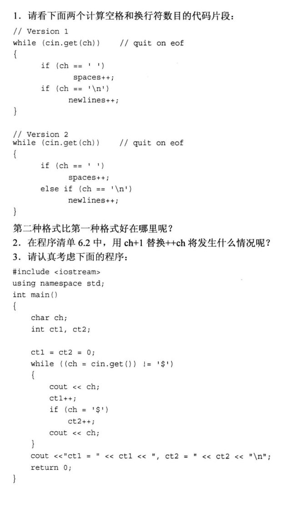
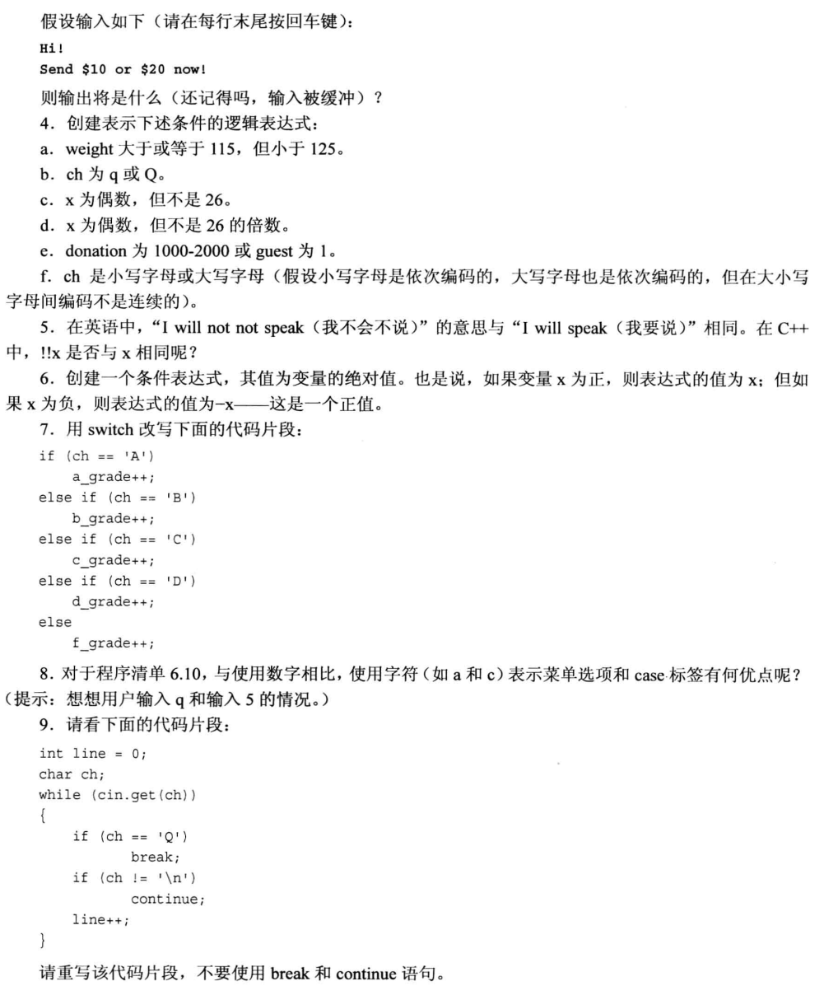

<!-- TOC -->

- [分支语句和逻辑运算符](#分支语句和逻辑运算符)
  - [`if`语句](#if语句)
    - [`if else`语句](#if-else语句)
    - [格式化`if else `语句](#格式化if-else-语句)
    - [`if else if else`结构](#if-else-if-else结构)
  - [逻辑运算符](#逻辑运算符)
    - [逻辑 OR：||](#逻辑-or)
    - [逻辑 AND：\&\&](#逻辑-and)
    - [逻辑 NOT 运算符：！](#逻辑-not-运算符)
  - [`?:`运算符](#运算符)
  - [`switch`语句](#switch语句)
  - [`break`和`continue`语句](#break和continue语句)
  - [读取数字的循环](#读取数字的循环)
  - [简单文件输入/输出](#简单文件输入输出)
    - [写入文本文件中](#写入文本文件中)
  - [读取文本文件](#读取文本文件)
  - [复习题](#复习题)

<!-- /TOC -->

# 分支语句和逻辑运算符

## `if`语句

基本格式：

```cpp
if (test-condition)
   statement;
```

### `if else`语句

基本格式：

```cpp
if (test-condition)
    statement1;
else
    statement2;
```

### 格式化`if else `语句

`if else` 中多条语句，构成语句块，需要用大括号将它们括起来

### `if else if else`结构

基本格式：

```cpp
if (test-condition1)
    statement1;
else if (test-condition2)
    ststement2;
else (test-statement3)
    statement3;
```

## 逻辑运算符

逻辑 OR（||），逻辑 AND（&&），逻辑 NOT（！）

### 逻辑 OR：||

||：有 1 为 1，全 0 为 0，优先级低于关系运算符

如果左侧的表达式为`true`，则 C++不会再计算右边的表达式，判定为`true`

```cpp
5 == 5 || 5 == 9;
```

### 逻辑 AND：&&

&&：有 0 为 0，全 1 为 1，优先级低于关系运算符，**优先级高于逻辑 OR**

如果左侧的表达式为``false`，则 C++不会再计算右侧表达式，判定为`false`

例子：

```cpp
#include<iostream>
using namespace std;
const int SIZE = 6;

int main(void)
{
    float value[SIZE];
    float temp;
    int i = 0;

    cout << "Enter six numbers and compare with your level." << endl;
    cout << "Terinate condition, when you make 6 number or enter a nagative number" << endl;

    cout << "First value: ";
    cin >> temp;

    while(i < SIZE && temp >= 0)
    {
        value[i] = temp;
        ++i;
        if(i < SIZE)
        {
            cout << "Next value: ";
            cin >> temp;
        }
    }
    if(i == 0)
    {
        cout << "No data--bye.\n";
    }
    else
    {
        cout << "Enter your level: ";
        float level;
        cin >> level;
        int count = 0;
        for (int j = 0; j < i; j++)
        {
            if(value[j] > level)
            {
                count++;
            }
        }
        cout << count << " numbers are bigger the your level.\n";
    }

    return 0;
}
```

输出结果：

```cpp
Enter six numbers and compare with your level.
Terinate condition, when you make 6 number or enter a nagative number
First value: 123
Next value: 119
Next value: 4
Next value: 89
Next value: -1
Enter your level: 123.031
0 numbers are bigger the your level.
```

### 逻辑 NOT 运算符：！

！：将它后面的表达式真值取反。

！：**优先级高于所有的关系运算符和算术运算符**

```cpp
if(!(x > 5));
!strcmp(s1, s2); //如果两个字符串相同，则!strcmp(s1, s2) 为true
```

例如：

```cpp
#include<iostream>
#include<climits>
using namespace std;
bool is_int(double x);

int main(void)
{
    double num;

    cout << "Enter an integer value: ";
    cin >> num;

    while(!is_int(num))
    {
        cout << "Out of range, please enter again: ";
        cin >> num;
    }

    int val = (int)num;
    cout << "You've entered the integer: " << val << endl;

    return 0;
}

bool is_int(double x)
{
    if(x <= INT_MAX && x >= INT_MIN)
        return true;
    else
        return false;
}
```

输出结果：

```cpp
Enter an integer value: 6234128679
Out of range, please enter again: 100
You've entered the integer: 100
```

## `?:`运算符

expression1 ? expression2 : expression3;

## `switch`语句

`integer-expression` 必须是一个结果为**整数值**的表达式

`labelx` 必须为**整数常量表达式**

可以配合`break`语句跳出`case`，否则会默认执行下一个`case`

基本结构：

```cpp
switch (integer-expression)
{
    case label1: statement1;
    case label2: ststement2;
    ...
    default: statement;   //不是必须的
}
```

例子：

```cpp
#include<iostream>
using namespace std;
void showmenu(void);
void report();
void comfort();

int main(void)
{
    showmenu();

    int choice;
    cin >> choice;
    while(choice != 5)
    {
        switch(choice)
        {
            case 1:
                cout << "warning!!!" << endl;
                break;
            case 2:
                report();
                break;
            case 3:
                cout << "The boss was in all day." << endl;
                break;
            case 4:
                comfort();
                break;
            default:
                cout << "That is not a choice." << endl;
        }
        showmenu();
        cin >> choice;
    }

    cout << "Game over." << endl;

    return 0;
}

void showmenu(void)
{
    cout << "Please enter 1, 2, 3, 4, or 5:" << endl;
    cout << "1) alarm           2) report" << endl;
    cout << "3) alibi           3) comfrt" << endl;
    cout << "5) quit" << endl;
}
void report()
{
    cout << "Sales are up 120%, expenses are down 35%." << endl;
}
void comfort()
{
    cout << "You are the best CEO!" << endl;
}
```

输出结果：

```cpp
Please enter 1, 2, 3, 4, or 5:
1) alarm           2) report
3) alibi           3) comfrt
5) quit
1
warning!!!
Please enter 1, 2, 3, 4, or 5:
1) alarm           2) report
3) alibi           3) comfrt
5) quit
2
Sales are up 120%, expenses are down 35%.
Please enter 1, 2, 3, 4, or 5:
1) alarm           2) report
3) alibi           3) comfrt
5) quit
3
The boss was in all day.
Please enter 1, 2, 3, 4, or 5:
1) alarm           2) report
3) alibi           3) comfrt
5) quit
4
You are the best CEO!
Please enter 1, 2, 3, 4, or 5:
1) alarm           2) report
3) alibi           3) comfrt
5) quit
5
Game over.
```

## `break`和`continue`语句

`break` ：结束所有循环，直接执行循环体以外的语句
`continue` ：结束本轮循环，直接开始下一轮循环

例如：

```cpp
#include<iostream>
using namespace std;
const int SIZE = 80;

int main(void)
{
    char line[SIZE];
    int spaces = 0;

    cout << "Enter a line of text: \n";
    cin.get(line, SIZE);

    cout << "Complete line: " << line << endl;

    for (int i = 0; line[i] != '\0'; i++)
    {
        cout << line[i];

        //碰到句号，结束循环
        if(line[i] == '.')
            break;

        //不是空格就跳过，进行下一次循环
        if(line[i] != ' ')
            continue;

        //计算空格数量
        spaces++;
    }
    cout << endl;
    cout << "Spaces = " << spaces << endl;

    return 0;
}
```

输出结果：

```cpp
Enter a line of text:
good morning Mike.  Hello world.
Complete line: good morning Mike.  Hello world.
good morning Mike.
Spaces = 2
```

## 读取数字的循环

本应输入数字，但输入字符，发生类型不匹配时。

```cpp
int n;
cin >> n;
```

1. n 的值保持不变
2. 不匹配的输入将被留在输入队列中
3. cin 对象中的一个错误标记被设置
4. 对 cin 方法的调用将返回 false（如果被转换为 bool 类型）

例 6.5.cpp

```cpp
#include<iostream>
using namespace std;
const int MAX = 5;

int main(void)
{
    double fish[MAX];

    cout << "Please enter the weights of your fish.\n";
    cout << "You may enter up to " << MAX << " fish <q to terminate.\n";

    cout << "fish #1: ";
    int i = 0;

    while(i < MAX && cin >> fish[i])
    {
        if(++i < MAX)
        {
            cout << "fish #" << i + 1 << ": ";
        }
    }

    double total = 0.0;
    for (int j = 0; j < i; j++)
    {
        total = +fish[j];
    }

    if(i==0)
    {
        cout << "No fish." << endl;
    }
    else
    {
        cout << "Average weight of " << i << " fish: " << total / i << endl;
    }

        return 0;
}
```

输出结果：

```cpp
Please enter the weights of your fish.
You may enter up to 5 fish <q to terminate.
fish #1: 30
fish #2: 35
fish #3: 25
fish #4: 20
fish #5: 23
Average weight of 5 fish: 4.6
```

改进 6.5，在输入错误的时候

1. 重置 cin 已接受新的输入
2. 删除错误输入
3. 提示用户在输入

例 6.6cpp

```cpp
#include<iostream>
using namespace std;
const int MAX = 5;

int main(void)
{
    int golf[MAX];
    cout << "Please enter your golf scores.\n";
    cout << "You must enter " << MAX << " rounds.\n";

    int i;
    for (i = 0; i < MAX; i++)
    {
        cout << "Round#: " << i + 1 << ": " << endl;
        while (!(cin >> golf[i]))
        {
            cin.clear();
            while(cin.get() != '\n')
                ;
            cout << "Please enter a number: ";
        }
    }

    double total = 0.0;
    for (i = 0; i < MAX; i++)
    {
        total += golf[i];
    }
    cout << "Average score: " << total / MAX << ".\n";

    return 0;
}
```

输出结果：

```cpp
Please enter your golf scores.
You must enter 5 rounds.
Round#: 1:
88
Round#: 2:
99
Round#: 3:
xx
Please enter a number: sf
Please enter a number: 89
Round#: 4:
100
Round#: 5:
95
Average score: 94.2.
```

## 简单文件输入/输出

### 写入文本文件中

- 必须包含头文件`fstream`

例 6.7.cpp

```cpp
#include<iostream>  //ostream -> cout   istream -> cin
#include<fstream>   // 1. #include<fstream>   ofstream         ifstream
using namespace std;

int main(void)
{
    char automoblie[50];
    int year;
    double a_price;
    double d_price;

    ofstream outFile;             //2. 创建对象
    outFile.open("6_7.txt");      //3. 关联文件

    cout << "Enter the make and model of automoblie: ";
    cin.getline(automoblie, 50);
    cout << "Enter the model year: ";
    cin >> year;
    cout << "Enter the orignal asking price: ";
    cin >> a_price;
    d_price = a_price * 0.913;

    //输出到屏幕
    cout << fixed;                 //不要用科学计数法
    cout.precision(2);             //小数点后两位
    cout.setf(ios_base::showpoint);//强制显示位数
    cout << endl
         << "Make and mobel: " << automoblie << endl;
    cout << "Year: " << year << endl;
    cout << "Was asking: " << a_price << endl;
    cout << "Now aksing: " << d_price << endl;

    //输出到文件
    outFile << fixed;                  // 不要用科学计数法
    outFile.precision(2);              // 小数点后两位
    outFile.setf(ios_base::showpoint); // 强制显示位数
    outFile << "Make and mobel: " << automoblie << endl;
    outFile << "Year: " << year << endl;
    outFile << "Was asking: " << a_price << endl;
    outFile << "Now aksing: " << d_price << endl;

    outFile.close();                   //关闭文件
    return 0;
}
```

输出结果：

```cpp
Enter the make and model of automoblie: Flitz Perky
Enter the model year: 2009
Enter the orignal asking price: 13500

Make and mobel: Flitz Perky
Year: 2009
Was asking: 13500.00
Now aksing: 12325.50
```

## 读取文本文件

- 必须包含头文件`fstream` 使用`ifstream`类

例 6.8.txt

```cpp
#include<iostream>
#include<fstream>                 //1. 包含fstream头文件
#include<cstdlib>
using namespace std;
const int SIZE = 20;

int main(void)
{
    char filename[SIZE];

    cout << "Enter name of the data file: ";
    cin.getline(filename, SIZE);

    ifstream inFile;              //2. 创建对象
    inFile.open(filename);        //3. 关联文件

    //判断文件是否打开成功
    if(!inFile.is_open())
    {
        cout << "Could not open the file " << filename << endl;
        cout << "Program terminating.\n";
        exit(EXIT_FAILURE);
    }
    cout << "Sucees open txt file.\n";  //打开成功

    //读取文件内容
    double value;
    double sum = 0.0;
    int count = 0;

    inFile >> value;       //读取文件
    while(inFile.good())   //读取成功，计数
    {
        ++count;
        sum += value;
        inFile >> value;
    }

    if(inFile.eof())           //读取完成，到最后识别到文件末尾
    {
        cout << "End of file reached.\n";
    }
    else if(inFile.fail())     //读取失败,类型不匹配
    {
        cout << "Input terminated by data mismached.\n";
    }
    else
    {
        cout << "Input terminated by unknow reason.\n";
    }

    //显示读取后处理数据结果
    if(count == 0)
    {
        cout << "No data processed.\n";
    }
    else
    {
        cout << "Items read: " << count << endl;
        cout << "Sum: " << sum << endl;
        cout << "Average: " << sum / count << endl;
    }

    inFile.close();
    return 0;
}
```

输出结果：

```cpp
Enter name of the data file: 6_8.txt
Sucees open txt file.
End of file reached.
Items read: 11
Sum: 187
Average: 17
```

## 复习题




1. 第二种效率更高
2. ch+1 :类型提升，输出整型数；++ch :ASCII 值增加，输出下一个字符
3. ```cpp
   H$i$!$
   $S$e$n$d$ $ct1 = 9, ct2 = 9

   ```

4. - `weight >= 115 && weight < 125;`
   - `ch = 'q' || ch == 'Q';`
   - `(x % 2 == 0) && (x != 26);`
   - `(x % 2 == 0) && (x % 26 != 0);`
   - `(donation >= 1000 && donation <= 2000) || (1 == guest);`
   - `(ch >= 'a' && ch <= 'z') || (ch >= 'A' && ch <= 'Z');`
5. x 为 bool 类型的时候，相等；x 为其它类型的时候，不相等
6. `(x >= 0) ? x : -x;`
7. ```cpp
   switch(ch)
   {
       case 'A': a_grade++; break;
       case 'B': b_grade++; break;
       case 'C': c_grade++; break;
       case 'D': d_grade++; break;
       default: f_grade++;
   }
   ```
8. 当输入不是数字而是字符的时候，会出错；要是直接使用 char 类型的时候，输入字母不会有错误
9. ```cpp
   int line = 0;
   char ch;
   while(cin.get(ch) && ch != 'Q')
   {
       if (ch == '\n')
           line++;
   }
   ```

## 编程练习

1. 编写一个程序，读取键盘输入，直到遇到@符号为止，并回显输入(数字除外)，同时将大写字符转换为小写，将小写字符转换为大写(别忘了 cctype 函数系列)。

运行代码：

```cpp
#include<iostream>
#include<cctype>
using namespace std;

int main(void)
{
    cout << "Enter text for analysis, and type @ to terminate input.\n";

    char ch;

    cin.get(ch);
    while (ch != '@')
    {
        if(isdigit(ch))
        {
            cin >> ch;
            continue;
        }
        else if(islower(ch))
            ch = tolower(ch);
        else if(isupper(ch))
            ch = toupper(ch);
        else
            ;

        cout << ch;
        cin.get(ch); // 更新条件
    }

    cout << endl;

    return 0;
}
```

输出结果：

```cpp
Enter text for analysis, and type @ to terminate input.
sjisHDJ Jjd3ak.@ksk sk2
sjisHDJ Jjdak.
```

2. 编写一个程序，最多将 10 个 donation 值读入到一个 double 数组中（如果您愿意，也可使用模板类 array)。程序遇到非数字输入时将结束输入，并报告这些数字的平均值以及数组中有多少个数字大于平均值。

运行代码：

```cpp
#include<iostream>
using namespace std;
const int MAX = 10;

int main(void)
{
    double Donation[MAX] = {0};

    cout << "Please enter the donation.\n";
    cout << "You may enter up to 10 donations <not number to terminate>.\n";

    //输入最多10个donation
    cout << "donation #1: ";
    int i = 0;
    while (i < MAX && cin >> Donation[i])
    {
        if(++i < MAX)
        {
            cout << "donation #" << i + 1 << ": ";
        }
    }

    //计算平均值
    double total;
    for (int j = 0; j < MAX; j++)
    {
        total += Donation[j];
    }
    double average = total / i;

    //计数
    int count = 0, count_t = 0;
    for (int j = 0; (j < MAX) && (Donation[j] != 0) ; j++)
    {
        ++count;
        if (Donation[j] > average)
            ++count_t;
    }

    if (0 == i)
    {
        cout << "No donation.\n";
    }
    else
    {
        cout << "Average of " << count << " donations = " << average << ", and " << count_t << " donations are upper than average.\n";
    }

        return 0;
}
```

输出结果：

```cpp
Please enter the donation.
You may enter up to 10 donations <not number to terminate>.
donation #1: 1
donation #2: 2
donation #3: 3
donation #4: 4
donation #5: 5
donation #6: 6
donation #7: 7
donation #8: q
Average of 7 donations = 4, and 3 donations are upper than average.
```

3. 编写一个菜单驱动程序的雏形。该程序显示一个提供 4 个选项的菜单---每个选项用一个字母标记。如果用户使用有效选项之外的字母进行响应，程序将提示用户输入一个有效的字母，直到用户这样做为止。然后，该程序使用一条 switch 语句，根据用户的选择执行一个简单操作。该程序的运行情况如下:

```cpp
Please enter one of the following choices:
c) carnivore         p) pianist
t) tree              g) game
f
Please enter a c, p, t, or g: q
Please enter a c, p, t, or g: t
A maple is a tree.
```

运行代码：

```cpp
#include<iostream>
using namespace std;
void showmenu(void);

int main(void)
{
    showmenu();

    char ch;
    cin >> ch;
    while(1)
    {
        switch(ch)
        {
            case 'c':
                cout << "A maple is a carnivore.\n";
                break;
            case 'p':
                cout << "A maple is pianist.\n";
                break;
            case 't':
                cout << "A maple is a tree.\n";
                break;
            case 'g':
                cout << "A maple is a game.\n";
                break;
            default:
                cout << "Please enter a c, p, t, or g: ";
        }
        if(ch == 'c' || ch == 'p' || ch == 't' || ch == 'g')
            break;
        else
            cin >> ch;
    }

    return 0;
}

void showmenu(void)
{
    cout << "Please enter one of the following choices:\n";
    cout << "c)canivore         p)pianist" << endl;
    cout << "t)tree             g)game" << endl;
}
```

输出结果：

```cpp
Please enter one of the following choices:
c)canivore         p)pianist
t)tree             g)game
f
Please enter a c, p, t, or g: d
Please enter a c, p, t, or g: c
A maple is a carnivore.
```

4. 加入 Benevolent Order of Programmer 后，在 BOP 大会上，人们便可以通过加入者的真实姓名、头衔或秘密 BOP 姓名来了解他（她)。请编写一个程序，可以使用真实姓名、头衔、秘密姓名或成员偏好来列出成员。编写该程序时，请使用下面的结构:

```cpp
// Benevolent order of Programmers name structure
struct bop {
char fullname[strsize];      //real name
char title[strsize];         //job title
char bopname [strsize];      //secret BOP name
int preference;              // 0 = fullname，1 = title,2 = bopname
};
```

该程序创建一个由上述结构组成的小型数组，并将其初始化为适当的值。另外，该程序使用一个循环，让用户在下面的选项中进行选择:

```cpp
a. display by name      b. display by title
c. display by bopname   d. display by preference
q. quit
```

注意，“display by preference”并不意味着显示成员的偏好，而是意味着根据成员的偏好来列出成员。例如，如果偏好号为 1，则选择 d 将显示程序员的头衔。该程序的运行情况如下:

```cpp
Benevolent order of Programmers Report
a. display by name      b. display by title
c. display by bopname   d. display by preference
q. quit
Enter your choice: a
wimp Macho
Raki Rhodes
celia Laiter
Hoppy Hipman
Pat Hand
Next choice: d
wimp Macho
Junior Programmer
MIPS
Analyst Trainee
LOOPY
Next choice: q
Bye!
```

运行代码：

```cpp
#include<iostream>
using namespace std;
const int SIZE = 20;
const int userSize = 5;
void showmenu(void);

struct bop
{
    char fullname[SIZE];
    char tile[SIZE];
    char bopname[SIZE];
    int perference;
};

void show(bop arr[], int size, char ch);

int main(void)
{
    showmenu();

    bop CXY[userSize] =
        {
            {"Wimp Macho", "Senior Programmer", "DAVIS", 0},
            {"Raki Rhodes", "Junior Programmer", "MIKE", 1},
            {"Celia Laiter", "Analyst Trainee", "MIPS", 2},
            {"Hoppy Hipam", "Analyst Trainee", "CURRY", 1},
            {"Pat Hand", "Junior Programmer", "LOOPY", 2}
        };

    cout << "Enter your choice: ";
    char choice;
    cin >> choice;
    while(1)
    {
        switch (choice)
        {
            case 'a':
                show(CXY,userSize,'a');
                break;
            case 'b':
                show(CXY,userSize,'b');
                break;
            case 'c':
                show(CXY,userSize,'c');
                break;
            case 'd':
                show(CXY,userSize,'d');
                break;
            case 'q':
                cout << "Bye!\n";
                break;
            default:
                cout << "Please enter a a, b, c, d, or q: ";
        }

        if (choice == 'a' || choice == 'b' || choice == 'c' || choice == 'd')
        {
            cout << endl << "Next choice: ";
            cin >> choice;
        }
        else if(choice == 'q')
        {
            break;
        }
        else
        {
            cin >> choice;
        }
    }

    return 0;
}

void showmenu(void)
{
    cout << "Benevolent order of Programmers Report\n";
    cout << "a. display by name      b. display by title\n";
    cout << "c. display by bopname   d. display by preference\n";
    cout << "q. quit\n";
}
void show(bop arr[], int size, char ch)
{
    switch(ch)
    {
        case 'a':
            for (int j = 0; j < size; j++)
            {
                cout << arr[j].fullname << endl;
            }
            break;
        case 'b':
            for (int j = 0; j < size; j++)
            {
                cout << arr[j].tile << endl;
            }
            break;
        case 'c':
            for (int j = 0; j < size; j++)
            {
                cout << arr[j].bopname << endl;
            }
            break;
        case 'd':
            for (int j = 0; j < size; j++)
            {
                switch(arr[j].perference)
                {
                    case 0:
                        cout << arr[j].fullname << endl;
                        break;
                    case 1:
                        cout << arr[j].tile << endl;
                        break;
                    case 2:
                        cout << arr[j].bopname << endl;
                        break;
                }
            }
            break;
    }
}
```

输出结果：

```cpp
Benevolent order of Programmers Report
a. display by name      b. display by title
c. display by bopname   d. display by preference
q. quit
Enter your choice: a
Wimp Macho
Raki Rhodes
Celia Laiter
Hoppy Hipam
Pat Hand

Next choice: b
Senior Programmer
Junior Programmer
Analyst Trainee
Analyst Trainee
Junior Programmer

Next choice: c
DAVIS
MIKE
MIPS
CURRY
LOOPY

Next choice: d
Wimp Macho
Junior Programmer
MIPS
Analyst Trainee
LOOPY

Next choice: f
Please enter a a, b, c, d, or q: q
Bye!
```

5. 在 Neutronia 王国，货币单位是 tvarp，收入所得税的计算方式如下:
   $$
   5000 tvarps:不收税
   $$

$$
5001～15000 tvarps:10%
$$

$$
15001~35000 tvarps:15%
$$

$$
35000 tvarps 以上:20%
$$

例如，收入为 38000 tvarps 时，所得税为 5000 ×0.00 + 10000 ×0.10+20000 ×0.15 + 3000 × 0.20，即 4600 tvarps。请编写一个程序，使用循环来要求用户输入收入，并报告所得税。当用户输入负数或非数字时，循环将结束。

运行代码：

```cpp
#include<iostream>
using namespace std;

int main(void)
{
    double income = 0;
    double tax = 0;

    cout << "Enter your income: ";
    while ((cin >> income) && income >= 0)
    {
        if(income <= 5000)
            tax = 0;
        else if(income > 5000 && income <= 15000)
            tax = (income - 5000) * 0.1;
        else if(income > 15000 && income <= 35000)
            tax = 10000 * 0.1 + (income - 15000) * 0.15;
        else
            tax = 10000 * 0.1 + 20000 * 0.15 + (income - 35000) * 0.2;

        cout << "Your tax is: " << tax;
        cout << endl
             << "Enter your income: ";
    }

    cout << "Enter close!\n";

    return 0;
}

```

输出结果：

```cpp
Enter your income: 4000
Your tax is: 0
Enter your income: 6587
Your tax is: 158.7
Enter your income: 18953
Your tax is: 1592.95
Enter your income: 39847
Your tax is: 4969.4
Enter your income: q
Enter close!
```

6. 编写一个程序，记录捐助给“维护合法权利团体”的资金。该程序要求用户输入捐献者数目，然后要求用户输入每一个捐献者的姓名和款项。这些信息被储存在一个动态分配的结构数组中。每个结构有两个成员:用来储存姓名的字符数组（或 string 对象）和用来存储款项的 double 成员。读取所有的数据后，程序将显示所有捐款超过 10000 的捐款者的姓名及其捐款数额。该列表前应包含一个标题，指出下面的捐款者是重要捐款人（Grand Patrons)。然后，程序将列出其他的捐款者，该列表要以 Patrons 开头。如果某种类别没有捐款者，则程序将打印单词“none”。该程序只显示这两种类别，而不进行排序。

运行代码：

```cpp
#include<iostream>
#include<string>
using namespace std;
struct donor
{
    string Name;
    double Figure;
};

int main(void)
{
    int num;
    cout << "Enter the numbers of patrons: ";
    cin >> num;

    donor *pd = new donor[num];
    for (int i = 0; i < num; i++)
    {
        cout << "Name #" << i + 1 << ": ";
        cin >> (pd + i)->Name;
        cout << "Figure #" << i + 1 << ": ";
        cin >> (pd + i)->Figure;
    }

    int count_gp = 0, count_p = 0;
    for (int i = 0; i < num; i++)
    {
        if(((pd+i)->Figure) >= 10000)
            count_gp++;
        else
            count_p++;
    }

    cout << endl
         << "**********Grand Patrons**********\n";
    if (count_gp > 0)
    {
        for (int i = 0; i < num; i++)
        {
            if (((pd + i)->Figure) >= 10000)
            {
                cout << (pd + i)->Name << ": " << (pd + i)->Figure << endl;
            }
        }
    }
    else
    {
        cout << "none.\n";
    }

    cout << "*************Patrons***********8*\n";
    if (count_p > 0)
    {
        for (int i = 0; i < num; i++)
        {
            if (((pd + i)->Figure) < 10000)
            {
                cout << (pd + i)->Name << ": " << (pd + i)->Figure <<endl ;
            }
        }
    }
    else
    {
        cout << "none.\n";
    }

        return 0;
}
```

输出结果：

```cpp
Enter the numbers of patrons: 3
Name #1: wjsd
Figure #1: 2000
Name #2: sjsn
Figure #2: 20000
Name #3: snsn
Figure #3: 2993

**********Grand Patrons**********
sjsn: 20000
*************Patrons*************
wjsd: 2000
snsn: 2993
```

7. 编写一个程序，它每次读取一个单词，直到用户只输入 q。然后，该程序指出有多少个单词以元音打头，有多少个单词以辅音打头，还有多少个单词不属于这两类。为此，方法之一是，使用 isalpha()来区分以字母和其他字符打头的单词，然后对于通过了 isalpha()测试的单词，使用 if 或 switch 语句来确定哪些以元音打头。该程序的运行情况如下:

```cpp
Enter words (q to quit) :
The 12 awesome oxen ambled
quietly across 15 meters of lawn. q
5 words beginning with vowels
4 words beginning with consonants
2 others
```

运行代码：

```cpp
#include<iostream>
#include<string>
#include<cctype>
using namespace std;

int main(void)
{
    string ch;
    cout << "Enter wods (q to quit): " << endl;

    int vowel = 0;
    int consonant = 0;
    int other = 0;

    while((cin >> ch) && (ch != "q"))
    {
        if (isalpha(ch[0]))
        {
            switch (ch[0])
            {
            case 'a':
            case 'A':
            case 'e':
            case 'E':
            case 'i':
            case 'I':
            case 'o':
            case 'O':
            case 'u':
            case 'U':
                ++vowel;
                break;
            default:
                ++consonant;
                break;
            }
        }
        else
        {
            ++other;
        }
    }

    cout << vowel << " words beginning with vowels\n";
    cout << consonant << " words beginning with consonants\n";
    cout << other << " others\n";

    return 0;
}
```

输出结果：

```cpp
Enter wods (q to quit):
The 12 awesome oxen ambled quietly across 15 meters of lawn. q
5 words beginning with vowels
4 words beginning with consonants
2 others
```

8. 编写一个程序，它打开一个文件文件，逐个字符地读取该文件，直到到达文件末尾，然后指出该文件中包含多少个字符。

运行代码：

```cpp
#include<iostream>
#include<string>
#include<cstdlib>
#include<fstream>
using namespace std;

int main(void)
{
    string filename;

    cout << "Enter the name of the file: ";
    cin >> filename;

    ifstream inFile;
    inFile.open(filename);

    //判断文件是否打开成功，打开文件后的必须操作
    if (!inFile.is_open())
    {
        cout << "Could not open the file " << filename << endl;
        cout << "Program terminating.\n";
        exit(EXIT_FAILURE);            //打开失败
    }
    cout << "Sucees open txt file.\n"; // 打开成功

    //读取文件，必须验证读取文件是否成功 inFile.good()
    int count = 0;
    char ch;

    while(inFile >> ch)
    {
        ++count;
    }

    //判断是否读取完成
    if (inFile.eof()) // 读取完成，到最后识别到文件末尾
    {
        cout << "End of file reached.\n";
    }
    else if (inFile.fail()) // 读取失败,类型不匹配
    {
        cout << "Input terminated by data mismached.\n";
    }
    else
    {
        cout << "Input terminated by unknow reason.\n";
    }

    //显示读取信息
    if (count == 0)
    {
        cout << "No data processed.\n";
    }
    else
    {
        cout << "This txt has " << count << " characters.\n";
    }

    inFile.close();
    return 0;
}
```

输出结果：

```cpp
Enter the name of the file: t6_8.txt
Sucees open txt file.
End of file reached.
This txt has 50 characters.
```

9. 完成编程练习 6，但从文件中读取所需的信息。该文件的第一项应为捐款人数，余下的内容应为成对的行。在每一对中，第一行为捐款人姓名，第二行为捐款数额。即该文件类似于下面:

```cpp
4
sam stone
2000
Freida Flass
100500
Tammy Tubbs
5000
Rich Raptor
55000
```

运行代码：

```cpp
#include<iostream>
#include<string>
#include<fstream>
#include<cstdlib>
using namespace std;
struct donor
{
    string Name;
    double Figure;
};

int main(void)
{
    string filename;

    cout << "Enter the name of the file: ";
    getline(cin, filename);

    ifstream inFile;
    inFile.open(filename);
    if(!inFile.is_open())
    {
        cout << "Could not open the file " << filename << endl;
        cout << "Program terminating.\n";
        exit(EXIT_FAILURE);
    }

    //读取文件
    int num, i = 0;

    inFile >> num;                    //读出需要存储的捐款人数
    if(num <= 0)
        exit(EXIT_FAILURE);
    donor *pd = new donor[num];       //生成动态分配的结构数组

    inFile.get();                     //消耗回车

    while((!inFile.eof()) && (i < num))
    {

        getline(inFile, (pd + i)->Name);
        cout << "Read name #" << i + 1 << ": " << (pd + i)->Name << endl;
        inFile >> (pd + i)->Figure;
        cout << "Donation #" << i + 1 << ": " << (pd + i)->Figure << endl;

        i++;
        inFile.get();
    }

    int count_gp = 0, count_p = 0;

    for (int i = 0; i < num; i++)
    {
        if (((pd + i)->Figure) >= 10000)
            count_gp++;
        else
            count_p++;
    }

    cout << endl
         << "**********Grand Patrons**********\n";
    if (count_gp > 0)
    {
        for (int i = 0; i < num; i++)
        {
            if (((pd + i)->Figure) >= 10000)
            {
                cout << (pd + i)->Name << ": " << (pd + i)->Figure << endl;
            }
        }
    }
    else
    {
        cout << "none.\n";
    }

    cout << "*************Patrons*************\n";
    if (count_p > 0)
    {
        for (int i = 0; i < num; i++)
        {
            if (((pd + i)->Figure) < 10000)
            {
                cout << (pd + i)->Name << ": " << (pd + i)->Figure << endl;
            }
        }
    }
    else
    {
        cout << "none.\n";
    }

    inFile.close();
    return 0;
}
```

输出结果：

```cpp
Enter the name of the file: t6_9.txt
Read name #1: sam stone
Donation #1: 2000
Read name #2: Freida Flass
Donation #2: 100500
Read name #3: Tammy Tubbs
Donation #3: 5000
Read name #4: Rich Raptor
Donation #4: 55000

**********Grand Patrons**********
Freida Flass: 100500
Rich Raptor: 55000
*************Patrons*************
sam stone: 2000
```
