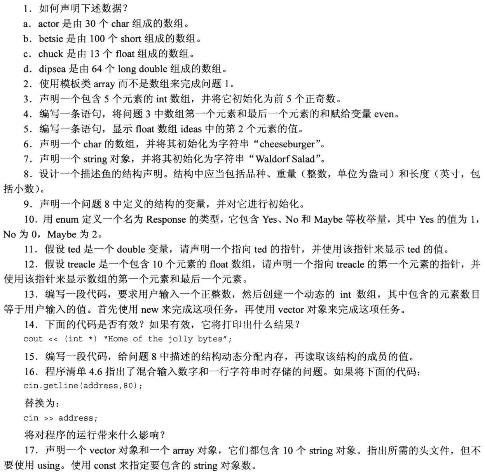

<!-- TOC -->

- [复合类型](#复合类型)
  - [数组](#数组)
    - [数组初始化规则](#数组初始化规则)
    - [`C++11` 数组初始化方法](#c11-数组初始化方法)
  - [字符串（C-style string）](#字符串c-style-string)
    - [每次读取整行的字符串输入](#每次读取整行的字符串输入)
      - [`getlin()`](#getlin)
      - [`get()`](#get)
    - [混合输入字符串和数字](#混合输入字符串和数字)
  - [`string`类 (C++ style string)](#string类-c-style-string)
    - [赋值、拼接和附加](#赋值拼接和附加)
    - [使用c语言库的字符串处理函数](#使用c语言库的字符串处理函数)
  - [结构简介](#结构简介)
    - [其他结构属性](#其他结构属性)
    - [结构数组](#结构数组)
  - [共用体`union`](#共用体union)
  - [枚举`enum`](#枚举enum)
    - [设置枚举量的值](#设置枚举量的值)
    - [枚举的取值范围](#枚举的取值范围)
  - [指针和自由存储空间](#指针和自由存储空间)
    - [指针的危险](#指针的危险)
    - [指针和数字](#指针和数字)
    - [使用`new`来分配内存](#使用new来分配内存)
    - [使用`delete`释放内存](#使用delete释放内存)
    - [使用`new`来创建动态数组](#使用new来创建动态数组)
      - [使用new创建动态数组](#使用new创建动态数组)
      - [使用动态数组](#使用动态数组)
  - [指针、数组和指针算术](#指针数组和指针算术)
    - [指针和字符串](#指针和字符串)
    - [使用new创建动态结构](#使用new创建动态结构)
  - [类型组合综合运用](#类型组合综合运用)
  - [数组的替代品](#数组的替代品)
    - [模板类vector](#模板类vector)
    - [模板类array(C++11)](#模板类arrayc11)
  - [复习题](#复习题)
  - [编程练习](#编程练习)

<!-- /TOC -->
# 复合类型

## 数组

能够存储多个同类型的值。创建数组，可使用声明语句：
+ 存储在每个元素中的值的类型
+ 数组名
+ 数组中的元素数

声明数组的通用格式如下：
```cpp
typeName arrayName[arraySize];
```

`arraySize`必须是整型常数或`const`值，也可以是常量表达式

数组的下标编号从0开始

**必须确保程序只使用有效的下标值** 

```cpp
#include<iostream>
using namespace std;

int main(void)
{
    int yams[3] = {7, 8, 6};
    int yamcosts[3] = {20, 30, 5};

    cout << "The total yams = " << yams[0] + yams[1] + yams[2] << endl;
    cout << "The package with " << yams[1] << " yams cost " << yamcosts[1] << " cents per yam." << endl;
    cout << "The total yam expense is " << yamcosts[0] * yams[0] + yamcosts[1] * yams[1] + yamcosts[2] * yams[2] << " cents." << endl;
    
    cout << endl;

    cout << "Size of yams array = " << sizeof yams << " bytes." << endl;
    cout << "Size of one element = " << sizeof yams[0] << " bytes." << endl;

    return 0;
}
```

### 数组初始化规则

1. 只有在定义数组时才能使用初始化，此后不能使用，也不能将一个数组赋给另一个数组

```cpp
int cards[3] = {1,2,3};    //ok
int hand[4];               //ok
hand[4] = {1,2,3,4};       //not allowed
hand = cards;              //not allowed
```

```cpp
The total yams = 21
The package with 8 yams cost 30 cents per yam.
The total yam expense is 410 cents.

Size of yams array = 12 bytes.
Size of one element = 4 bytes.
```

2. 可以使用下标分别给数组中的元素赋值
3. 初始化时提供的值可以**少于**数组元素的数目
4. 直接初始化为全0，`int a[5] = {0};`
5. 初始化时方括号内可以为空，**C++编译器将计算元素个数**

### `C++11` 数组初始化方法

1. 初始化时可以省略`=`
2. 可不在大括号内包含任何东西，这将把所有元素设置为0
3. 列表初始化禁止缩窄转换


## 字符串（C-style string）

使用C库的头文件，需要包含`#include<cstring>`

1. 单引号引用单个字符，并以空字符`\0`结尾 
2. 双引号直接引用一串字符，结尾自动隐式加上`\0`
3. C++输入工具通过键盘输入，将字符串读入char数组当中，自动加上`\0`
4. 单引号引用的是字符，双引号引用的是字符串

### 每次读取整行的字符串输入

`getline()` 读取一行输入，直到换行符，并**将换行符丢弃，替换为空字符存储**

`get()` 读取一行输入，直到换行符，并**将其留在输入队列中**

`getline()`使用起来简单一点、`get()`使得检查错误更简单一些

#### `getlin()`

使用`cin.getline()`调用这种方法。两个参数，第一个参数用来存储输入行的数组名称，第二个参数是要读取的字符数。

```cpp
cin.getline(name,20);//最多读取19个字符
```

#### `get()`

使用`cin.get()`调用这种方法。两种方式，不带参数，读取下一个字符。

**函数重载**：函数名相同、参数不同

### 混合输入字符串和数字

使用`cin.get()`读取换行符，处理混合输入数字和面向行的字符串会导致的问题。

```cpp
#include<iostream>
using namespace std;

int main(void)
{
    int year;

    cout << "What year was your house built?" << endl;
    cin >> year;//回车保留在了缓冲区，需要清除
    cin.get();//read enter
    cout << "What is its street address?" << endl;
    char address[80];
    cin.getline(address, 80);

    cout << "Year built: " << year << endl;
    cout << "Address: " << address << endl;

    return 0;
}
```

输出结果：
```cpp
What year was your house built?
1997
What is its street address?
Xi'an
Year built: 1997
Address: Xi'an 
```

## `string`类 (C++ style string)

必须包含头文件string,来使用string类

```cpp
#include<string>
```

```cpp
#include<iostream>
#include<string>
using namespace std;

int main(void)
{
    char arr1[20];
    char arr2[20] = "jaguar";
    string str1;
    string str2 = "panther";

    cout << "Enter a kind of feline: ";
    cin >> arr1;
    cout << "Enter another kind of feline: ";
    cin >> str1;
    cout << "Here are some felines:\n";
    cout << arr1 << " " << arr2 << " " << str1 << " " << str2 << endl;

    cout << "The third letter in " << arr2 << " is " << arr2[2] << endl;
    cout << "The third letter in " << str2 << " is " << str2[2] << endl;

    cout << sizeof(str2) << endl;

    return 0;
}
```

### 赋值、拼接和附加

可是使用运算符，十分方便
```cpp
#include<iostream>
#include<string>
using namespace std;

int main(void)
{
    string s1 = "penguin";
    string s2, s3;

    cout << "You can assign one string object to another: s2 = s1\n";
    s2 = s1; //可以直接赋值
    cout << "s1: " << s1 << ", s2: " << s2 << endl;

    cout << "You can assign a C-style string to a string object.\n";
    s2 = "buzzard"; //赋值进行更改
    cout << "s2: " << s2 << endl;

    cout << "You can concatennate strings: s3 = s1 + s2\n";
    s3 = s1 + s2;//加号 进行字符串合并
    cout << "s3: " << s3 << endl;

    s1 += s2; //+=附加一个字符串
    cout << "s1 += s2 yields s1 = " << s1 << endl;

    s2 += " for a day."; //+=附加字符串
    cout << "s2 =+ \" for a day\" yields s2 = " << s2 << endl;

    return 0;
}
```

输出结果：
```cpp
You can assign one string object to another: s2 = s1
s1: penguin, s2: penguin
You can assign a C-style string to a string object. 
s2: buzzard
You can concatennate strings: s3 = s1 + s2
s3: penguinbuzzard
s1 += s2 yields s1 = penguinbuzzard
s2 =+ " for a day" yields s2 = buzzard for a day.  
```

### 使用c语言库的字符串处理函数

引用 `#include<cstring>` , 使用`strcpy()` , `strcat()`

string类读取一行时使用句法有所不同，使用`getline(cin,str);`


## 结构简介

结构可以把不同的数据类型封装到一个单元当中。

结构是用户定义的类型，而**结构声明**定义了这种类型的数据属性。

创建结构包括两步：

1. 定义结构描述
2. 按照描述创建结构变量

```cpp
struct inflatable
{
    char name[20];
    float volume;
    double price;
}；//必须加上分号
```

关键字`struct`表明，这些代码定义的是一个结构的布局。标识符`inflatable`是这种数据类型的名称，可以像`int`,`double`等一样创建变量。

```cpp
#include<iostream>
using namespace std;

struct inflatable
{
    char name[20];
    float volume;
    double price;
};

int main(void)
{
    inflatable guest =
    {
        "Glorious Gloria",
        1.88,
        29.99
    };
    inflatable pal =
    {
        "Audacious Arthur",
        3.12,
        32.99
    };

    cout << "Enter your guest list with " << guest.name << " and " << pal.name << endl;
    cout << "You can have both for $" << guest.price + pal.price << endl;

    return 0;
}
```

输出结果：
```cpp
Enter your guest list with Glorious Gloria and Audacious Arthur
You can have both for $62.98
```

### 其他结构属性

1. 结构体定义和创建变量可以同时完成。
```cpp
struct perks
{
    int number;
    char car[12];
}mr_smith, ms_jones;
```

2. 甚至可以初始化的时候同时赋值。

3. 还可以声明**没有名称**的结构类型

### 结构数组

**首先**是一个数组，数组中的**每一个元素**都是**结构体类型**，

```cpp
#include <iostream>
using namespace std;
struct inflatable
{
    char name[20];
    float volume;
    double price;
};

int main(void)
{
    inflatable guests[2] =
        {
            {"Bambi", 0.5, 21.99},
            {"Godazilla", 2000, 565.99}};

    cout << "The guests " << guests[0].name << " and " << guests[1].name << " have a combined volume of "
         << guests[0].volume + guests[1].volume << " cubic feet." << endl;

    return 0;
}
```

输出结果：
```cpp
he guests Bambi and Godazilla have a combined volume of 2000.5 cubic feet.
```

## 共用体`union`

共用体`union`是一种数据类型，能够存储不同的数据类型，但只能**同时存储其中一种类型**。只能使用`int`;`float`;`double`中的一种


## 枚举`enum`

创建符号常量

```cpp
enum spectrum{red,orange,yellow,green,blue,violet};
```

1. 枚举类型
2. red orange yellow 等作为符号常量，对应整数值0~5.
3. `spectrum`变量受到限制，只有8个可能的值
4. 对于枚举只定义了赋值运算，**只能赋值定义枚举时的枚举变量**

**使用枚举类型的目的是定义符号常量**，同时定义连续多个符号常量
 
### 设置枚举量的值

使用赋值运算符来显式地设置枚举量的值

```cpp
enum bits{one=1, two=2, four=4, eight=8};
```

也可以只显式的定义一些枚举量的值

```cpp
enum bigstep{first,second=100,third};//first默认为0，third为101
```

最后可以创建多个值相同的枚举量

```cpp
enum {zero, null=0, one, numero_one};//zero,null都为0，one,numero_one都为1
```

### 枚举的取值范围

**枚举声明范围**中的取值都可以成为枚举值。

**范围上限**：找出最大值，大于最大值的最小的2次幂减1；

**范围下限**：找出最小值，如果不小于0，下限就是0；如果小于0，小于最小值的2次幂（加上负号），再加1


## 指针和自由存储空间

取地址运算符`（&）`，`&home`, 取出变量`home`的地址 

指针类型的意义：

1. 决定了解引用的权限多大
2. 决定了加减指针时的步进多大

**指针的大小相同**，但是指针所**指向的内容**大小不一样大

### 指针的危险

1. 创建指针时，计算机将分配用来**存储指针的内存**，但不会分配用来**存储指针所指向的数据的内存**。
2. 警告:一定要在对指针应用解除引用运算符(*)之前，将指针初始化为一个确定的、适当的地址。这是关于使用指针的金科玉律。

### 指针和数字

指针不是整型。不能简单的将整数赋值给指针：
```cpp
int *pt;
pt = 0xB8000000;  //not allowed
```

### 使用`new`来分配内存

`new`寻找可以存储int类型的内存块，并返回首地址

```cpp
int *pn = new int;
```
通用格式：

```cpp
typeName *pointer_name = new typeName;
```

```cpp
#include<iostream>
using namespace std;

int main(void)
{
    int nights = 1001;
    int *pt = new int;
    *pt = 1001;

    cout << "nights value = " << nights << ",location = " << &nights << endl;
    cout << "int value = " << *pt << ", location = " << pt << endl;

    double *pd = new double;
    *pd = 27348.39;

    cout << "double value = " << *pd << ", location = " << pd << endl;

    cout << "*pd location = " << &pd << endl;//取出指针的地址

    cout << "size of pt = " << sizeof(pt) << "; size of *pt = " << sizeof(*pt) << endl;
    cout << "size of pd = " << sizeof(pd) << "; size of *pd = " << sizeof(*pd) << endl;

    return 0;
}
```
输出结果：
```cpp
nights value = 1001,location = 0x61fe14    
int value = 1001, location = 0x632530      
double value = 27348.4, location = 0x632550
*pd location = 0x61fe08
size of pt = 8; size of *pt = 4
size of pd = 8; size of *pd = 8
```

`int`类型、`double`类型的指针变量的大小是一样的,具体大小由计算机决定

### 使用`delete`释放内存

```cpp
int *ps = new int;
...
delete ps;
```
这将**释放ps指向的内存**，但**不会删除指针ps本身**。例如，可以将ps重新指向另一个新分配的内存块。

`new` , `delete` 成对出现 

### 使用`new`来创建动态数组

静态联编和动态联编

#### 使用new创建动态数组

要创建一个包含10个int元素的数组
```cpp
int *psome = new int[10];
```
`new`运算符返回首元素的地址

当程序使用完`new`分配的内存块时，应使用`delete`释放他们。对于使用`new`创建的数组，应使用另一种格式的`delete`来释放:

```cpp
delete [] psome;
```

使用`new`,`delete`，应遵循以下规则：
+ 不要使用`delete`来释放不是`new`分配的内存
+ 不要使用`delete`释放同一个内存块两次
+ 如果使用`new[]`为数组分配内存，则应使用`delete[]`来释放
+ 如果使用`new`为一个实体分配内存，则应使用`delete`（没有方括号）来释放
+ 对空指针应用`delete`是安全的

#### 使用动态数组

```cpp
#include<iostream>
using namespace std;

int main(void)
{
    double *p3 = new double[3];
    p3[0] = 0.2;
    p3[1] = 0.5;
    p3[2] = 0.8;

    cout << "p3[1] is " << p3[1] << endl;
    cout << "(p3 + 1) is: " << *(p3 + 1) << endl;

    delete[] p3;//与new配套，释放内存

    return 0;
}
```
输出结果：
```cpp
p3[1] is 0.5    
(p3 + 1) is: 0.5
```

## 指针、数组和指针算术

指针和数组基本等价的原因在于指针运算和C++内部处理数组的方式。

将整数加1后，其值将加1；指针变量加1，将跳跃到下一个元素

```cpp
#include<iostream>
using namespace std;

int main(void)
{
    double wages[3] = {100.0, 200.0, 299.9};
    short stacks[3] = {3, 2, 1};

    double *pw = wages;      //数组名表示数组首元素地址
    short *ps = &stacks[0];

    cout << "pw = " << pw << ", *pw = " << *pw << endl;
    pw += 1;
    cout << "add 1 to the pw pointer:" << endl;
    cout << "pw = " << pw << ", pw = " << *pw << endl;

    cout << endl;

    cout << "ps = " << ps << ", *ps = " << *ps << endl;
    ps += 1;
    cout << "add 1 to the ps pointer:" << endl;
    cout << "ps = " << ps << ", ps = " << *ps << endl;

    cout << endl;

    cout << "stacks[0] = " << stacks[0] << ", stacks[1] = " << stacks[1] << endl;
    cout << "*stacks = " << *stacks << ", *(stacks+1) = " << *(stacks + 1) << endl;

    cout << "size of wages array = " << sizeof(wages) << endl;
    cout << "size of pw pointer = " << sizeof(pw) << endl;

    return 0;
}
```

输出结果：
```cpp
pw = 0x61fdf0, *pw = 100
add 1 to the pw pointer:
pw = 0x61fdf8, pw = 200 

ps = 0x61fdea, *ps = 3      
add 1 to the ps pointer:    
ps = 0x61fdec, ps = 2       

stacks[0] = 3, stacks[1] = 2
*stacks = 3, *(stacks+1) = 2
size of wages array = 24
size of pw pointer = 8
```

可以修改指针的值，而数组名是常量。

数组名被解释为第一个元素的地址，而对**数组名应用地址运算符**时，得到的是整个数组的地址：
```cpp
short tell[10];
cout << tell << endl;
cout << &tell << endl;
```

### 指针和字符串

`cout`识别一个字符的地址，则将从该字符开始打印，直到遇到空字符为止。

字符串数组名，及`“”`引用的字符串都表示首地址。

```cpp
char name[20] = "ross";
cout << name << "is red.";
```

```cpp
#include<iostream>
#include<cstring>
using namespace std;

int main(void)
{
    char animal[20] = "bear";
    const char *bird = "wren";
    char *ps;

    cout << animal << " and " << bird << endl;

    cout << "Enter a kind of animal: ";
    cin >> animal;
    cout << animal << endl;

    ps = animal;
    cout << ps << endl;

    cout << animal << " at " << (int *)animal << endl;
    cout << ps << " at " << (int *)ps << endl;

    cout << "After using strcpy.\n";
    ps = new char[strlen(animal) + 1];
    strcpy(ps, animal);
    cout << animal << " at " << (int *)animal << endl;
    cout << ps << " at " << (int *)ps << endl;
    delete[] ps;

    return 0;
}
```

输出结果：
```cpp
bear and wren
Enter a kind of animal: fox
fox
fox
fox at 0x61fdf0    
fox at 0x61fdf0    
After using strcpy.
fox at 0x61fdf0    
fox at 0x25b2540
```

### 使用new创建动态结构

```cpp
inflatable *ps = new inflatable;
```

使用指向结构体的指针：
```cpp
#include<iostream>
using namespace std;

struct inflatable
{
    char name[20];
    float volume;
    double price;
};

int main(void)
{
    inflatable *ps = new inflatable;
    cout << "Enter name of inflatable item: ";
    cin.get(ps->name, 20);//结构体指针访问成员，使用->
    cout << "Enter volume in cubic feet: ";
    cin >> ps->volume;
    cout << "Enter price $";
    cin >> ps->price;

    cout << "Nanme: " << ps->name << endl;
    cout << "Volume: " << ps->volume << endl;
    cout << "Price: $" << ps->price << endl;
    delete ps;

    return 0;
}
```

输出结果：
```cpp
Enter name of inflatable item: Eabulous Frodo
Enter volume in cubic feet: 1.4
Enter price $27.99
Nanme: Eabulous Frodo
Volume: 1.4
Price: $27.99 
```

定义函数`getname()`,示例使用`new`,`delete`

```cpp
#include<iostream>
#include<cstring>
using namespace std;
char *getname();

int main(void)
{
    char *name;
    name = getname();
    cout << name << " at " << (int *)name << endl;
    delete[] name;

    return 0;
}

char *getname()
{
    char arr[80];
    cout << "Enter last name: ";
    cin >> arr;
    char *pn = new char[strlen(arr) + 1];
    strcpy(pn, arr);

    return pn;
}
```

## 类型组合综合运用

```cpp
#include<iostream>
using namespace std;

struct aye
{
    int year;
};

int main(void)
{
    aye s1, s2, s3;

    s1.year = 1998;

    aye *pa = &s2;
    pa->year = 1999;

    aye trio[3];
    trio[0].year = 2003;

    cout << trio->year << endl;

    const aye *arp[3] = {&s1, &s2, &s3};
    cout << arp[1]->year << endl;

    const aye **ppa = arp;
    cout << (*ppa)->year << endl;  //*ppa = arp[0]

    auto ppb = arp;
    cout << (*(ppb + 1))->year << endl;

    return 0;
}
```
输出结果：
```cpp
2003
1999
1998
1999
```

## 数组的替代品

### 模板类vector

是一种动态数组

要使用vector，必须包含头文件vector,使用命名空间std；模板使用不同的语法来指出它存储的数据类型；vector类使用不同的语法来指定元素数。

一般而言，下面声明创建一个名为vt的vector对象，它可以存储n_elem个类型为typeName的元素：

```cpp
vector<typename> vt(n_elem);
```

其中参数`b_elem`可以是整型常量，也可以是整型变量。

### 模板类array(C++11)

包含头文件，使用命名空间std；

下面声明创建一个名为`arr`的`array`对象，它包含n_elem个类型为typename的元素：
```cpp
array<typename, n_elem> arr;
```

与`vector`不同的是，`n_elem`是常量

```cpp
#include<iostream>
#include<vector>
#include<array>
using namespace std;

int main(void)
{
    double a1[4] = {1.2, 2.3, 3.6, 4.8};

    vector<double> a2(4); //地址在内存的堆中，其他的在内存的栈中
    a2[0] = 1.0 / 3.0;
    a2[1] = 1.0 / 5.0;
    a2[2] = 1.0 / 7.0;
    a2[3] = 1.0 / 9.0;

    array<double, 4> a3 = {3.14, 2.72, 1.62, 1.41};
    array<double, 4> a4;

    //a3数据传递给a4,可以直接赋值运算符传递
    a4 = a3;

    cout << "a1[2]: " << a1[2] << " at " << &a1[2] << endl;
    cout << "a2[2]: " << a2[2] << " at " << &a2[2] << endl;
    cout << "a3[2]: " << a3[2] << " at " << &a3[2] << endl;
    cout << "a4[2]: " << a4[2] << " at " << &a4[2] << endl;

    return 0;
}
```

输出结果：
```cpp
a1[2]: 3.6 at 0x62fdf0     
a2[2]: 0.142857 at 0xd52550
a3[2]: 1.62 at 0x62fdb0    
a4[2]: 1.62 at 0x62fd90 
```

## 复习题


1. 声明数据
   1. char actor[30];
   2. short betsie[100];
   3. float chuck[13];
   4. long double dipsea[64];
2. 使用模板类array
   ```cpp
   #include<array>
   array<char, 30> actor;
   array<short, 100> betsie;
   array<float, 13> chuck;
   array<long double, 64> dipsea;
   ```
3. int arr[5]={1,3,5,7,9}；
4. ```cpp
   int arr[5]={1,3,5,7,9};
   int even = arr[0] + arr[4]; 
   ```
5. ```cpp
   float ideas[10];
   cout << ideas[1] << endl;
   ```
6. `char arr[] = "cheeseburge";`
7. `string arr = "Waldorf Salad";`
8. ```cpp
   struct fish
   {
       char kind[20];
       int weight;
       float length;
   };
   ```
9. ```cpp
   struct fish
   {
       char kind[20];
       int weight;
       float length;
   };
   fish ff = 
   {  
       "Bigfish",
       12,
       4.2 
   };
   ```
10. `enum Rseponse = {No, Yes, Maybe};`
11. ```cpp
    double ted = 1.8;
    double *pd = &ted;
    cout << "ted = " << *pd <<endl;
    ```
12. ```cpp
    float treacle[10] = {0};
    float *pt = tracle;
    cout << "treacle[0] = " << *pt << ", treacle[9] = " << *(pt+9)<<endl;
    ```
13. 创建代码
```cpp
#include<iostream>
using namespace std;

int main(void)
{
    cout << "Enter a number: ";
    cin >> size;
    int *pt = new int[size]; 
    return 0;
}

#include<vector>
int main(void)
{
    cout << "Enter a number: ";
    cin >> size;
    vector<int> vn(size);

    return 0;
}
```
14. 有效，强制类型转换后，打印的是字符串的首地址
15. 
```cpp
#include<iostream>
using namespace std;
struct fish
{
    char kind[20];
    int weight;
    float length;
};

int main(void)
{
    fish *pf = new fish;
    pt->kind = "djajk";
    pt->weight = 8;
    pt->length = 10.8;
    cout << pt->kind << ", " <<pt->weight << ", " << pt->length << endl;

    return 0;
}
```
16. `address`中的空格键将成为`cin`的中断，剩下的字符串将暂存在缓冲区当中，影响下一次的`cin`。
17.
 ```cpp
#include<iostream>
#include<string>
#include<vector>
#include<array>
const int SIZE = 10;

int main(void)
{
    std::vector<std::string> arr(SIZE);
    std::array<std::string, SIZE> ary; 

    return 0;
}
```

## 编程练习

1. 编写一个C++程序，如下述输出示例所示的那样请求并显示信息:
```cpp
what is your first name? Betty sue
what is your last name? Yewe
what letter grade do you deserve? B
what is your age? 22
Name: Yewe，Betty sue
Grade: c
Age: 22
```

运行代码：
```cpp
#include<iostream>
#include<string>
using namespace std;
struct message
{
    string first_name;
    string last_name;
    char l_grade;
    int age;
};

int main(void)
{
    message GJT;

    cout << "What is your first name? ";
    getline(cin, GJT.first_name);
    cout << "What is your last name? ";
    cin >> GJT.last_name;
    cout << "What latter grade do you deserve? ";
    cin >> GJT.l_grade;
    cout << "What is your age? ";
    cin >> GJT.age;

    cout << "Name: " << GJT.last_name << ", " << GJT.first_name << endl;
    cout << "Grade: " << char(GJT.l_grade + 1) << endl;
    cout << "Age: " << GJT.age << endl;

    return 0;
}
```
输出结果：
```cpp
What is your first name? Betty sue
What is your last name? Yewe
What latter grade do you deserve? B
What is your age? 22
Name: Yewe, Betty sue
Grade: C
Age: 22
```

2. 修改程序清单4.4，使用C++ string类而不是char数组。
```cpp
#include<iostream>
#include<string>
using namespace std;

int main(void)
{
    string name;
    string dessert;

    cout << "Enter your name: " << endl;
    getline(cin, name);
    cout << "Enter your favorite dessert: " << endl;
    getline(cin, dessert);

    cout << "I have some delicious " << dessert << " for you, " << name << "." << endl;

    return 0;
}
```
输出结果：
```cpp
Enter your name: 
GJT 
Enter your favorite dessert: 
cake
I have some delicious cake for you, GJT.
```

3. 编写一个程序，它要求用户首先输入其名，然后输入其姓;然后程序使用一个逗号和空格将姓和名组合起来，并存储和显示组合结果。请使用char数组和头文件cstring 中的函数。下面是该程序运行时的情形:
```cpp
Enter your first name: Flip
Enter your last name: Fleming
Here's the information in a single string: Fleming,Flip
```

运行代码：
```cpp
#include<iostream>
#include<cstring>
using namespace std;
const int SIZE = 20;

int main(void)
{
    char first_name[SIZE];
    char last_name[SIZE];
    char full_name[2 * SIZE];

    cout << "Enter your first name: ";
    cin.getline(first_name, SIZE);
    cout << "Enter your last name: ";
    cin.getline(last_name, SIZE);
    strcpy(full_name, last_name);
    strcat(full_name, ", ");
    strcat(full_name, first_name);

    cout << "Here's the information in a single string: " << full_name << endl;

    return 0;
}
```
输出结果：
```cpp
Enter your first name: Flip
Enter your last name: Fleming
Here's the information in a single string: Fleming, Flip
```

4. 编写一个程序，它要求用户首先输入其名，再输入其姓;然后程序使用一个逗号和空格将姓和名组合起来，并存储和显示组合结果。请使用string对象和头文件 string 中的函数。下面是该程序运行时的情形:
```cpp
Enter your first name: Flip
Enter your last name: Fleming
Here's the information in a single string: Fleming,Flip
```

运行代码：
```cpp
#include<iostream>
#include<string>
using namespace std;

int main(void)
{
    string first_name;
    string last_name;
    string full_name;

    cout << "Enter your first name: ";
    getline(cin, first_name);
    cout << "Enter your last name: ";
    getline(cin, last_name);
    full_name = last_name + ", " + first_name;

    cout << "Here's the information in a single string: " << full_name << endl;

    return 0;
}
```
输出结果：
```cpp
Enter your first name: Flip
Enter your last name: Fleming
Here's the information in a single string: Fleming, Flip
```

5. 结构CandyBar包含3个成员。第一个成员存储了糖块的品牌;第二个成员存储糖块的重量（可以有小数);第三个成员存储了糖块的卡路里含量（整数)。请编写一个程序，声明这个结构，创建一个名为snack的 CandyBar变量，并将其成员分别初始化为“Mocha Munch”、2.3和350。初始化应在声明snack时进行。最后，程序显示snack变量的内容。

运行代码：
```cpp
#include<iostream>
#include<string>
using namespace std;
struct CandyBar
{
    string brand;
    double weight;
    int calorie;
} snack =
    {
        "Mocha Munch",2.3,350
    };
int main(void)
{
    cout << "This snack is: " << snack.brand << ", " << snack.weight << ", " << snack.calorie << endl;

    return 0;
}
```
输出结果：
```cpp
This snack is: Mocha Munch, 2.3, 350
```

6. 结构 CandyBar包含3个成员，如编程练习5所示。请编写一个程序，创建一个包含3个元素的CandyBar数组，并将它们初始化为所选择的值，然后显示每个结构的内容。

运行代码：
```cpp
#include<iostream>
#include<string>
using namespace std;
struct CandyBar
{
    string brand;
    double weight;
    int calorie;
};

int main(void)
{
    CandyBar snack[3];

    cout << "Enter the brand of the snack: ";
    getline(cin, snack[0].brand);
    cout << "Enter the weight of the snack: ";
    cin >> snack[0].weight;
    cout << "Enter the calorie of the snack: ";
    cin >> snack[0].calorie;

    cout << "This snack is: " << snack[0].brand << ", " << snack[0].weight << ", " << snack[0].calorie << endl;

    return 0;
}
```
输出结果：
```cpp
Enter the brand of the snack: Mocha Munch
Enter the weight of the snack: 2.3 
Enter the calorie of the snack: 250
This snack is: Mocha Munch, 2.3, 250
```

7. William Wingate从事比萨饼分析服务。对于每个披萨饼，他都需要记录下列信息:
   + 披萨饼公司的名称，可以有多个单词组成。
   + 披萨饼的直径。
   + 披萨饼的重量。

运行代码：
```cpp
#include<iostream>
#include<string>
using namespace std;
struct William
{
    string name;
    double diameter;
    double weight;
};

int main(void)
{
    William pizza[3];
    
    cout << "Enter the name of the pizza company: ";
    getline(cin, pizza[0].name);
    cout << "Enter the diameter of the pizza in inches: ";
    cin >> pizza[0].diameter;
    cout << "Enter the weight of the pizza in pounds: ";
    cin >> pizza[0].weight;

    cout << "Pizza company is: " << pizza[0].name << ", diameter in inches: " << pizza[0].diameter << ", weight in pounds: " << pizza[0].weight << "." << endl;

    return 0;
}
```
输出结果：
```cpp
Enter the name of the pizza company: KFC
Enter the diameter of the pizza in inches: 12.5
Enter the weight of the pizza in pounds: 5.5
Pizza company is: KFC, diameter in inches: 12.5, weight in pounds: 5.5.
```

8. 完成编程练习7，但使用new来为结构分配内存，而不是声明一个结构变量。另外，让程序在请求输入比萨饼公司名称之前输入比萨饼的直径。

运行代码：
```cpp
#include<iostream>
#include<string>
using namespace std;
struct William
{
    string name;
    double diameter;
    double weight;
};

int main(void)
{
    William *pw = new William;

    cout << "Enter the diameter of the pizza: ";
    cin >> pw->diameter;
    cin.get();
    cout << "Enter the name of the pizza company: ";
    getline(cin, pw->name);
    cout << "Enter the weight of the pizza: ";
    cin >> pw->weight;

    cout << "Pizza company is: " << pw->name << ", diameter in inches: " << pw->diameter << ", weight in pounds: " << pw->weight << "." << endl;

    delete pw;

    return 0;
}
```
输出结果：
```cpp
Enter the diameter of the pizza: 12.5
Enter the name of the pizza company: KFC
Enter the weight of the pizza: 5.5
Pizza company is: KFC, diameter in inches: 12.5, weight in pounds: 5.5.
```

9. 完成编程练习6，但使用new来动态分配数组，而不是声明一个包含3个元素的CandyBar数组。

运行代码：
```cpp
#include<iostream>
#include<string>
using namespace std;
const int SIZE = 3;

struct CandyBar
{
    string brand;
    double weight;
    int calorie;
};

int main(void)
{
    CandyBar *pc = new CandyBar[SIZE];

    cout << "Enter the snack's name: ";
    getline(cin, pc->brand);
    cout << "Enter the snack's weight: ";
    cin >> pc->weight;
    cout << "Enter the snack's calorie: ";
    cin >> pc->calorie;

    cout << "This snack is: " << pc->brand << ", " << pc->weight << ", " << pc->calorie << endl;

    delete[] pc; //不要忘记释放内存

    return 0;
}
```
输出结果：
```cpp
Enter the snack's name: Mocha Munch
Enter the snack's weight: 2.3
Enter the snack's calorie: 350
This snack is: Mocha Munch, 2.3, 350
```

10. 编写一个程序，让用户输入三次40码跑的成绩（如果您愿意，也可让用户输入40米跑的成绩)，并显示次数和平均成绩。请使用一个array对象来存储数据（如果编译器不支持array类,请使用数组)。

运行代码：
```cpp
#include<iostream>
#include<array>
using namespace std;

int main(void)
{
    array<double, 3> grade;

    cout << "Enter three records of 40 meters: " << endl;
    cout << "Enter your first record of 40m: ";
    cin >> grade[0];
    cout << "Enter your second record of 40m: ";
    cin >> grade[1];
    cout << "Enter your third record of 40m: ";
    cin >> grade[2];

    double average = (grade[0] + grade[1] + grade[2]) / 3.0;

    cout << endl
         << "1st: " << grade[0] << "; 2nd: " << grade[1] << "; 3rd: " << grade[2] << endl;
    cout << "You ran 3 times, and you average record is: " << average << endl;

    return 0;
}
```
输出结果：
```cpp
Enter three records of 40 meters: 
Enter your first record of 40m: 6.2
Enter your second record of 40m: 5.9
Enter your third record of 40m: 6.1

1st: 6.2; 2nd: 5.9; 3rd: 6.1
You ran 3 times, and you average record is: 6.06667
```

